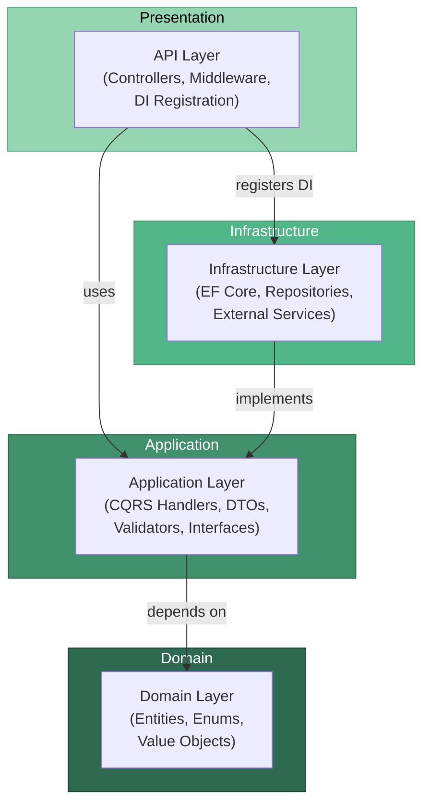
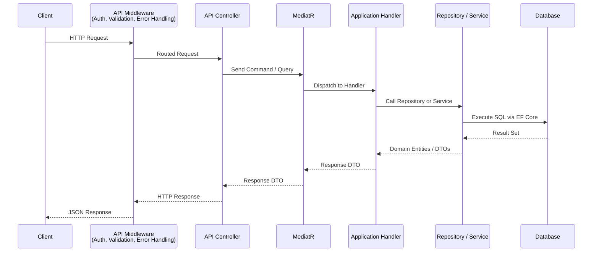

# ScholarPath Architecture

## Overview

ScholarPath follows **Clean Architecture** (also referred to as Onion Architecture), ensuring a clear separation of concerns, testability, and independence from external frameworks. The dependency rule is strict: inner layers never depend on outer layers. All dependencies point inward toward the Domain layer.

The solution is organized into four distinct projects:

| Layer | Project | Responsibility |
|---|---|---|
| Domain | `ScholarPath.Domain` | Entities, enums, value objects, domain interfaces |
| Application | `ScholarPath.Application` | CQRS commands/queries (handlers to be implemented by team), DTOs, validators, service interfaces |
| Infrastructure | `ScholarPath.Infrastructure` | EF Core DbContext, repository implementations, external services |
| API | `ScholarPath.API` | Controllers, middleware, DI composition root, Swagger |

---

## Layer Dependency Diagram



### Dependency Rules

1. **Domain Layer** has a single external dependency: `Microsoft.Extensions.Identity.Stores` (for `IdentityUser<Guid>` base class). It defines entities, enums, and domain-level interfaces.
2. **Application Layer** depends on Domain. It defines use-case logic via MediatR handlers, FluentValidation validators, and service/repository interfaces.
3. **Infrastructure Layer** depends on Application (to implement its interfaces). It never exposes its own abstractions upward.
4. **API Layer** depends on Application (to send commands/queries) and references Infrastructure only at the composition root for dependency injection registration.

---

## Request Flow

Every HTTP request follows a predictable pipeline from the client through the layers and back.



### Pipeline Behaviors

MediatR pipeline behaviors intercept every command/query before it reaches the handler:

1. **ValidationBehavior** -- Runs FluentValidation rules. Returns 400 if validation fails.
2. **LoggingBehavior** -- Logs request metadata for observability.

---

## Technology Stack by Layer

| Layer | Technologies |
|---|---|
| **Domain** | C# 13, .NET 10, Microsoft.Extensions.Identity.Stores (IdentityUser) |
| **Application** | MediatR (CQRS), FluentValidation, AutoMapper |
| **Infrastructure** | Entity Framework Core 10 (SQL Server + SQLite), ASP.NET Identity, JWT Bearer Auth, Redis (StackExchange.Redis), Hangfire, Serilog, Newtonsoft.Json (Hangfire transitive dependency override) |
| **API** | ASP.NET Core 10 Web API, Swagger/OpenAPI, SignalR (ASP.NET Core shared framework), API Versioning (Asp.Versioning.Mvc), Health Checks |
| **Cross-Cutting** | Serilog (logging), Docker, GitHub Actions (CI/CD) |

---

## Project Structure

```
ScholarPath/
  server/
    src/
      ScholarPath.Domain/
        Common/
        Entities/
        Enums/
        Interfaces/
      ScholarPath.Application/
        Auth/
          DTOs/
          Validators/
        Common/
      ScholarPath.Infrastructure/
        Persistence/
        Repositories/
        Services/
        Settings/
      ScholarPath.API/
        Controllers/
        Middleware/
    tests/
      ScholarPath.UnitTests/
      ScholarPath.IntegrationTests/
  client/
  docs/
  docker-compose.yml
```

---

## Key Design Decisions

| Decision | Rationale |
|---|---|
| Clean Architecture | Enforces testability and framework independence |
| CQRS via MediatR | Separates read and write concerns; simplifies handler logic |
| FluentValidation | Declarative validation rules, separated from handler logic |
| EF Core with SQL Server | Mature ORM with strong migration support; SQL Server for production, SQLite for local development |
| ASP.NET Identity | Built-in user management, password hashing, role-based auth |
| JWT + Refresh Tokens | Stateless authentication with secure token rotation |
| Soft Deletes | Data recovery and audit compliance via `ISoftDeletable` |
| Domain IdentityUser Dependency | Pragmatic trade-off: Domain depends on `Microsoft.Extensions.Identity.Stores` to use `IdentityUser<Guid>` as the base class for `ApplicationUser`, avoiding a separate mapping layer |
| SignalR via Shared Framework | SignalR is part of `Microsoft.AspNetCore.App` shared framework -- no separate NuGet package required, referenced via `<FrameworkReference>` in Infrastructure |
