# ScholarPath Entity Relationship Diagram

## Overview

This document describes the current data model for ScholarPath. Most entities inherit from `BaseEntity` (providing `Id`, `CreatedAt`, `UpdatedAt`), while some inherit from `AuditableEntity` (adding `CreatedBy`, `UpdatedBy`). `ApplicationUser` is the exception — it inherits from `IdentityUser<Guid>` and defines its own `CreatedAt`. Several entities implement soft-delete behavior via `ISoftDeletable`.

> **Note:** Community entities (Group, GroupMember, Post, Comment, Like, Message) have been removed from the domain and database as part of the security/architecture audit (March 2026). The Community feature will be re-implemented in a dedicated future sprint with a revised design.

---

## Full ERD

```mermaid
erDiagram
    ApplicationUser {
        guid Id PK "from IdentityUser~Guid~"
        string FirstName
        string LastName
        string ProfileImageUrl "nullable"
        int Role "UserRole enum"
        int AccountStatus "AccountStatus enum"
        bool IsOnboardingComplete
        datetime CreatedAt
        datetime LastLoginAt "nullable"
        bool IsActive
        string UserName "from IdentityUser"
        string Email "from IdentityUser"
        string PasswordHash "from IdentityUser"
        string PhoneNumber "from IdentityUser"
    }

    UserProfile {
        guid Id PK
        guid UserId FK
        string FieldOfStudy "nullable"
        decimal GPA "nullable"
        string Interests "nullable, JSON array"
        string Country "nullable"
        string TargetCountry "nullable"
        string Bio "nullable"
        string PhoneNumber "nullable"
        datetime DateOfBirth "nullable"
        string CreatedBy "nullable, AuditableEntity"
        string UpdatedBy "nullable, AuditableEntity"
        datetime CreatedAt
        datetime UpdatedAt "nullable"
    }

    RefreshToken {
        guid Id PK
        string Token
        datetime ExpiresAt
        string CreatedByIp "nullable"
        datetime RevokedAt "nullable"
        string RevokedByIp "nullable"
        string ReplacedByToken "nullable"
        guid UserId FK
        datetime CreatedAt
        datetime UpdatedAt "nullable"
    }

    UpgradeRequest {
        guid Id PK
        guid UserId FK
        int RequestedRole "UserRole enum"
        int Status "UpgradeRequestStatus enum"
        string AdminNotes "nullable"
        string RejectionReason "nullable"
        string ReviewedBy "nullable"
        datetime ReviewedAt "nullable"
        string ExperienceSummary "nullable"
        string ExpertiseTags "nullable"
        string Languages "nullable"
        string LinkedInUrl "nullable"
        string PortfolioUrl "nullable"
        string CompanyName "nullable"
        string CompanyCountry "nullable"
        string CompanyWebsite "nullable"
        string ContactPersonName "nullable"
        string ContactEmail "nullable"
        string ContactPhone "nullable"
        string CompanyRegistrationNumber "nullable"
        string ProofDocumentUrl "nullable"
        string CreatedBy "nullable, AuditableEntity"
        string UpdatedBy "nullable, AuditableEntity"
        datetime CreatedAt
        datetime UpdatedAt "nullable"
    }

    Scholarship {
        guid Id PK
        string Title
        string TitleAr "nullable"
        string Description
        string DescriptionAr "nullable"
        string ProviderName "nullable"
        string ProviderNameAr "nullable"
        string Country "nullable"
        string FieldOfStudy "nullable"
        int FundingType "ScholarshipFundingType enum"
        int DegreeLevel "DegreeLevel enum"
        int Status "ScholarshipStatus enum (Draft|Published|Archived)"
        decimal AwardAmount "nullable"
        string Currency "nullable"
        datetime Deadline "nullable"
        string EligibilityDescription "nullable"
        string RequiredDocuments "nullable"
        string OverviewHtml "nullable"
        string HowToApplyHtml "nullable"
        string OfficialLink "nullable"
        string ImageUrl "nullable"
        bool IsActive
        decimal MinGPA "nullable"
        int MaxAge "nullable"
        int ViewCount
        guid CategoryId "nullable FK"
        bool IsDeleted "ISoftDeletable"
        datetime DeletedAt "nullable, ISoftDeletable"
        string DeletedBy "nullable, ISoftDeletable"
        string CreatedBy "nullable, AuditableEntity"
        string UpdatedBy "nullable, AuditableEntity"
        datetime CreatedAt
        datetime UpdatedAt "nullable"
    }

    ScholarshipEligibleCountry {
        guid Id PK
        guid ScholarshipId FK
        string CountryCode
        datetime CreatedAt
        datetime UpdatedAt "nullable"
    }

    ScholarshipEligibleMajor {
        guid Id PK
        guid ScholarshipId FK
        string MajorName
        datetime CreatedAt
        datetime UpdatedAt "nullable"
    }

    ScholarshipDocumentItem {
        guid Id PK
        guid ScholarshipId FK
        string DocumentName
        datetime CreatedAt
        datetime UpdatedAt "nullable"
    }

    ExpertiseTag {
        guid Id PK
        string Name
        datetime CreatedAt
        datetime UpdatedAt "nullable"
    }

    SavedScholarship {
        guid Id PK
        guid UserId FK
        guid ScholarshipId FK
        datetime CreatedAt
        datetime UpdatedAt "nullable"
    }

    ApplicationTracker {
        guid Id PK
        guid UserId FK
        guid ScholarshipId FK
        int Status "ApplicationStatus enum"
        string Notes "nullable"
        datetime CreatedAt
        datetime UpdatedAt "nullable"
    }

    ApplicationReminder {
        guid Id PK
        guid ApplicationTrackerId FK
        datetime ReminderAt
        string Note "nullable"
        datetime CreatedAt
        datetime UpdatedAt "nullable"
    }

    Category {
        guid Id PK
        string Name
        string NameAr "nullable"
        string Description "nullable"
        string DescriptionAr "nullable"
        bool IsDeleted "ISoftDeletable"
        datetime DeletedAt "nullable, ISoftDeletable"
        string DeletedBy "nullable, ISoftDeletable"
        datetime CreatedAt
        datetime UpdatedAt "nullable"
    }

    Notification {
        guid Id PK
        guid UserId FK
        int Type "NotificationType enum"
        string Title
        string TitleAr "nullable"
        string Message
        string MessageAr "nullable"
        bool IsRead
        datetime ReadAt "nullable"
        guid RelatedEntityId "nullable"
        string RelatedEntityType "nullable"
        datetime CreatedAt
        datetime UpdatedAt "nullable"
    }

    Resource {
        guid Id PK
        string Title
        string TitleAr "nullable"
        string Description "nullable"
        string DescriptionAr "nullable"
        string Url "nullable"
        string Type "nullable"
        string Category "nullable"
        bool IsDeleted "ISoftDeletable"
        datetime DeletedAt "nullable, ISoftDeletable"
        string DeletedBy "nullable, ISoftDeletable"
        string CreatedBy "nullable, AuditableEntity"
        string UpdatedBy "nullable, AuditableEntity"
        datetime CreatedAt
        datetime UpdatedAt "nullable"
    }

    SuccessStory {
        guid Id PK
        guid UserId FK
        string Title
        string TitleAr "nullable"
        string Content
        string ContentAr "nullable"
        string ImageUrl "nullable"
        bool IsApproved
        datetime ApprovedAt "nullable"
        string ApprovedBy "nullable"
        bool IsDeleted "ISoftDeletable"
        datetime DeletedAt "nullable, ISoftDeletable"
        string DeletedBy "nullable, ISoftDeletable"
        string CreatedBy "nullable, AuditableEntity"
        string UpdatedBy "nullable, AuditableEntity"
        datetime CreatedAt
        datetime UpdatedAt "nullable"
    }

    %% === Relationships ===

    ApplicationUser ||--o| UserProfile : "has one"
    ApplicationUser ||--o{ RefreshToken : "has many"
    ApplicationUser ||--o{ UpgradeRequest : "submits"
    ApplicationUser ||--o{ SavedScholarship : "saves"
    ApplicationUser ||--o{ ApplicationTracker : "tracks"
    ApplicationUser ||--o{ Notification : "receives"
    ApplicationUser ||--o{ SuccessStory : "shares"

    Category ||--o{ Scholarship : "contains"
    Scholarship ||--o{ SavedScholarship : "saved by users"
    Scholarship ||--o{ ApplicationTracker : "tracked by users"
    Scholarship ||--o{ ScholarshipEligibleCountry : "eligible countries"
    Scholarship ||--o{ ScholarshipEligibleMajor : "eligible majors"
    Scholarship ||--o{ ScholarshipDocumentItem : "document checklist"
    Scholarship }o--o{ ExpertiseTag : "tagged with"

    ApplicationTracker ||--o{ ApplicationReminder : "has reminders"
```

---

## Relationship Summary

| Relationship | Type | Description |
|---|---|---|
| ApplicationUser - UserProfile | One-to-One | Each user has at most one profile |
| ApplicationUser - RefreshToken | One-to-Many | A user can have multiple active refresh tokens |
| ApplicationUser - UpgradeRequest | One-to-Many | A user can submit multiple upgrade requests over time |
| ApplicationUser - SavedScholarship | One-to-Many | A user saves multiple scholarships |
| ApplicationUser - ApplicationTracker | One-to-Many | A user tracks multiple scholarship applications |
| ApplicationUser - Notification | One-to-Many | A user receives many notifications |
| ApplicationUser - SuccessStory | One-to-Many | A user can share many success stories |
| Category - Scholarship | One-to-Many | Each scholarship optionally belongs to one category (nullable FK) |
| Scholarship - SavedScholarship | One-to-Many | A scholarship can be saved by many users |
| Scholarship - ApplicationTracker | One-to-Many | A scholarship can be tracked by many users |
| Scholarship - ScholarshipEligibleCountry | One-to-Many | A scholarship lists eligible countries as relational rows |
| Scholarship - ScholarshipEligibleMajor | One-to-Many | A scholarship lists eligible majors as relational rows |
| Scholarship - ScholarshipDocumentItem | One-to-Many | A scholarship has a checklist of required documents |
| Scholarship - ExpertiseTag | Many-to-Many | A scholarship can have multiple tags (join table implied) |
| ApplicationTracker - ApplicationReminder | One-to-Many | A tracked application can have multiple deadline reminders |

---

## Notes

- **ApplicationUser** inherits from `IdentityUser<Guid>` (not `BaseEntity`). It defines its own `CreatedAt` and includes Identity fields like `UserName`, `Email`, `PasswordHash`, etc.
- **SavedScholarship** and **ApplicationTracker** both have unique composite constraints `(UserId, ScholarshipId)` enforced at the database level.
- **ApplicationTracker** includes status-transition validation in the handler layer — invalid state changes (e.g., jumping from `Planned` to `Accepted`) are rejected.
- **Scholarship** previously used JSON columns (`EligibleCountries`, `EligibleMajors`) which have been refactored to relational child tables (`ScholarshipEligibleCountry`, `ScholarshipEligibleMajor`, `ScholarshipDocumentItem`) as of the March 2026 audit refactor.
- **ScholarshipStatus enum values:** `Draft=0`, `Published=1`, `Archived=2`.
- **ApplicationStatus enum values:** `Planned=0`, `Applied=1`, `Pending=2`, `Accepted=3`, `Rejected=4`.
- **UserRole enum values:** `Unassigned=0`, `Student=1`, `Consultant=2`, `Company=3`, `Admin=4`.
- Several entities use Arabic-language fields (`TitleAr`, `DescriptionAr`, `NameAr`, `ContentAr`, `MessageAr`) for bilingual support.
- **UpgradeRequest** contains role-specific fields: consultant fields (`ExperienceSummary`, `LinkedInUrl`, etc.) and company fields (`CompanyName`, `CompanyWebsite`, etc.).
- **Community entities** (Group, GroupMember, Post, Comment, Like, Message) were removed in the March 2026 audit and will be redesigned in a future sprint.
