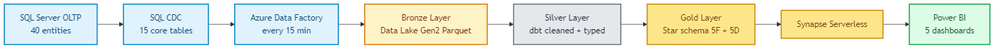
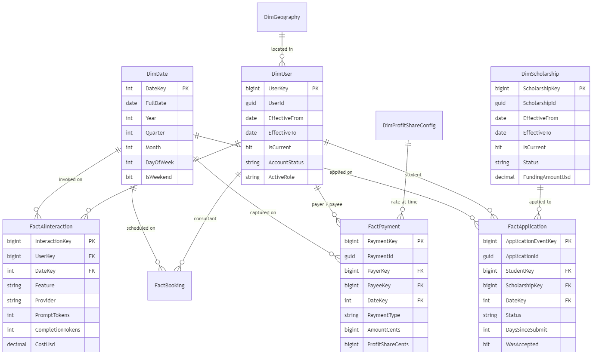
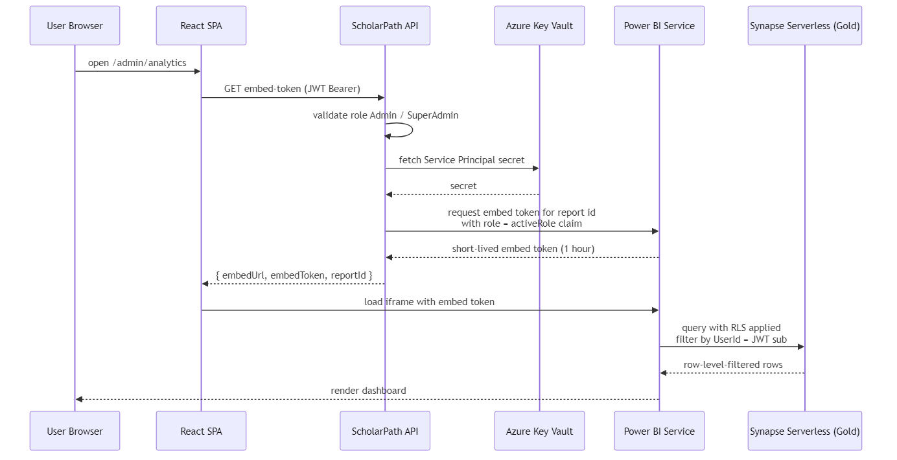
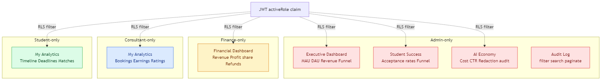
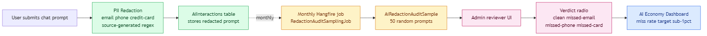

# ScholarPath — Analytics & Data Engineering

This document describes the analytics layer that sits on top of the transactional
platform. It is the companion to the four spec folders
`PB-015-analytics-foundation/`, `PB-016-data-warehouse/`, `PB-017-ai-economy/`,
and `PB-018-realtime-streaming/`.

## Contents

1. Architecture at a glance
2. Tech stack + why each piece
3. Medallion layout (Bronze / Silver / Gold)
4. Star schema — fact and dimension tables
5. Naming conventions
6. Security — embed tokens, RLS, redaction
7. Operations — dbt builds, data-quality assertions, alerts
8. Cost model
9. Local dev — how to work on analytics without Azure
10. Runbooks

## 1. Architecture at a glance



Three layers over Azure Data Lake Gen2 plus a thin Power BI presentation surface:

| Layer | Stores | Who writes | Who reads |
|------|--------|-----------|-----------|
| Bronze | raw Parquet, daily-partitioned, schema-on-read | Azure Data Factory (from CDC) | dbt staging models |
| Silver | cleaned, typed, de-duplicated Parquet | dbt staging + silver models | dbt marts |
| Gold | star schema (facts + dims, SCD Type 2) | dbt marts | Power BI, Synapse Serverless, reverse ETL |

The `PB-015` dashboards begin by reading the OLTP database directly (DirectQuery)
so the team ships a demo-ready result before the medallion pipeline is in place.
`PB-016` then replaces DirectQuery with Synapse Serverless queries on Gold.

## 2. Tech stack

| Concern | Tool | Why |
|---|---|---|
| Source of truth (OLTP) | SQL Server 2022 | already the system of record |
| Change capture | SQL Server CDC (built-in) | native, no external connector to manage |
| Ingestion | Azure Data Factory | Azure-native, free tier covers dev, visual pipelines the team can inspect |
| Storage | Azure Data Lake Gen2 | hierarchical namespace + cheap Parquet storage |
| Transformation | dbt-core with `dbt-sqlserver` adapter | SQL-first, testable, ships lineage + docs |
| Orchestration | ADF triggers + dbt Cloud (or Airflow) | ADF handles ingestion, dbt handles transforms |
| Warehouse query | Azure Synapse Serverless | pay-per-query, no cluster idle cost |
| BI | Power BI Pro + embed tokens | RLS, embeddable into the admin portal |
| Streaming | Azure Event Hub + Stream Analytics | PB-018 only — real-time tile + anomaly detection |
| Alerting | PagerDuty (production) + email (dev) | per-incident routing via stored secrets |
| Secrets | Azure Key Vault | no secret ever lands in git |

## 3. Medallion layout

### Bronze
```
datalake/bronze/
├── applications/
│   └── yyyy=2026/mm=05/dd=11/part-000.snappy.parquet
├── payments/
│   └── yyyy=2026/mm=05/dd=11/part-000.snappy.parquet
├── bookings/
│   ...
```

- 90-day online retention, archive tier after
- One file per CDC delta run (15 min cadence)
- Raw schema from CDC: `__$start_lsn`, `__$operation`, `__$seqval`, plus source columns

### Silver
```
datalake/silver/
├── applications/
│   └── part-*.snappy.parquet  (overwrite on rebuild)
├── payments/
│   ...
```

- Typed columns (no `nvarchar(max)` except genuine free-text)
- JSON columns flattened where schema is known (`TargetCountriesJson` → `target_countries` array column)
- Soft-delete flag honored — deleted rows excluded
- Business keys de-duplicated (`StudentId + ScholarshipId + CreatedAt`)
- dbt tests: `unique`, `not_null`, `relationships`, plus custom SQL

### Gold (star schema)



Five fact tables and five dimension tables. Two dims are SCD Type 2 (UserKey and
ScholarshipKey preserve history via `EffectiveFrom / EffectiveTo / IsCurrent`).

See the file-level comments in `analytics/dbt/models/marts/` for grain and
measure definitions.

## 4. Star schema reference

| Table | Grain | Key measures | Source epics |
|---|---|---|---|
| `FactApplication` | one application lifecycle event | decision time, was accepted, attachment count | PB-004 |
| `FactPayment` | one captured payment | gross, profit share, payee net, refunded | PB-013 + PB-014 |
| `FactBooking` | one consultant booking | scheduled duration, actual duration, no-show flag, price | PB-006 |
| `FactAiInteraction` | one AI call | prompt tokens, completion tokens, cost USD, succeeded | PB-008 + PB-017 |
| `FactForumActivity` | one post / vote / flag | (counts only, boolean flags) | PB-007 |
| `DimUser` (SCD2) | one user-version row | role, status, country | PB-001 + PB-002 |
| `DimScholarship` (SCD2) | one scholarship-version row | status, funding amount, target level | PB-003 |
| `DimDate` | one calendar day | year, quarter, month, day-of-week, is-weekend | synthetic |
| `DimGeography` | country → region → continent | — | seeded once |
| `DimProfitShareConfig` | one versioned rate row | booking pct, company review pct | PB-014 |

## 5. Naming conventions

- Schemas: `analytics_bronze`, `analytics_silver`, `analytics_gold` when materialized in Synapse.
- dbt layers: `stg_<table>`, `silver_<table>`, `fct_<grain>`, `dim_<attr>`.
- Snake case throughout dbt; PascalCase in C# models that read Gold.
- SCD2 columns: `EffectiveFrom`, `EffectiveTo` (nullable), `IsCurrent` (bit).
- Surrogate keys: `<Table>Key` as `BIGINT IDENTITY`.
- Business keys preserved as `<Table>Id` (the original Guid) for traceability.

See `docs/ANALYTICS-CONVENTIONS.md` (short checklist) for the minimum required
for every new model.

## 6. Security

### Embed tokens


The API owns a Service Principal (stored in Key Vault). When a user hits
`GET /admin/analytics`, the API mints a short-lived embed token scoped to the
caller's `activeRole` claim and returns it. The browser loads the Power BI
iframe with that token. No user ever sees the workspace credentials.

### Row-Level Security


Four RLS roles configured in each Power BI dataset:

- `[IsSameUser] = USERPRINCIPALNAME() = DimUser[Email]`
- `[IsFinance] = LOOKUPVALUE(DimUser[Role], DimUser[Email], USERPRINCIPALNAME()) = "Finance"`
- `[IsConsultant] = LOOKUPVALUE(...) = "Consultant"`
- `[IsStudent] = LOOKUPVALUE(...) = "Student"`

Verified by four impersonation tests as part of PB-015 acceptance (US-165).

### PII and redaction


Two invariants enforced in the pipeline (NFR-PartV-7):

1. Raw chat prompts are redacted at emit time (PB-008 `AskChatbotCommandHandler.RedactPii`) before they hit `AiInteractions.PromptText`.
2. Analytics pipelines never unredact — Bronze and Silver both hold the already-redacted text. Gold `FactAiInteraction` further hashes `UserId` for public dashboards.

A monthly random-sample audit (PB-017 US-178) measures redaction quality.
Target miss rate is below 1%.

## 7. Operations

### dbt build cycle
- Triggered hourly by ADF (or dbt Cloud).
- Order: `staging → silver → marts → tests → snapshot docs`.
- A single test failure halts the pipeline and prevents Gold from updating.
- Slack webhook + email alerts on failure (Service Principal-owned channels).

### Data-quality assertions (PB-016 US-171, FR-237/FR-238)

| Assertion | Enforced by |
|---|---|
| No orphan FKs from fact to dim | dbt `relationships` test |
| Enum columns hold only declared values | dbt `accepted_values` |
| No future-dated deadlines in `Scholarships` | custom singular test |
| No negative `AmountCents` | custom singular test |
| `Payment.IdempotencyKey` unique | dbt `unique` |
| CDC row-count drift below 0.1% | compared against OLTP snapshot nightly |

### Runbooks — common failures

- **ADF pipeline red.** Check CDC retention (3-day window). If CDC was disabled by a migration, re-enable and backfill from Silver snapshot.
- **dbt test fails on `Payment` FR-238.** Likely a Stripe webhook double-processed. Query `StripeWebhookEvent` and check `Payment.IdempotencyKey` uniqueness.
- **Power BI report shows zero rows.** Likely RLS misconfigured — impersonate as the affected role in Power BI Service and re-test.
- **Anomaly alert firing continuously.** The 7-day baseline may need reset (e.g., after a marketing push). Adjust baseline window via the Stream Analytics job config.

## 8. Cost model (estimated monthly)

Grad-project scale, per Azure calculator, May 2026:

| Component | Tier | Monthly USD |
|---|---|---:|
| Data Lake Gen2 | Standard + 10 GB | $2 |
| Azure Data Factory | 15-min trigger × 30 days | $10 |
| Synapse Serverless | 5 GB queried / day | $15 |
| Power BI Pro | 3 licenses (admins) | $30 |
| Event Hub (PB-018) | Standard tier, 1 TU | $22 |
| Stream Analytics | 1 SU | $80 |
| Key Vault | Standard | $0.03 |
| **Total (minimum viable)** | | **~$60** |
| **Total (with real-time PB-018)** | | **~$160** |

Production: expect ~3x once we move from grad-project seed data to real-world
load. This stays well within typical seed-stage infra budget.

## 9. Local dev — how to work without Azure

- **Bronze / Silver** can be emulated on your laptop by running dbt against the OLTP SQL Server (which `docker compose up -d` starts).
- **Power BI** Desktop can connect to `localhost:1433` directly — skip the embed-token setup in local mode.
- **Event Hub (PB-018)** — substitute with an in-memory Kafka (via `testcontainers`) for tests; only touch real Event Hub in staging.
- **Key Vault** — dev reads from `dotnet user-secrets`, production reads from Azure.

## 10. Ownership map

| Piece | Owner |
|---|---|
| Power BI reports + RLS | @TasneemShaaban |
| dbt staging + silver + tests | @yousra-elnoby |
| Data warehouse architecture + Gold schema | @ma7moudalysalem |
| ADF pipelines + IaC | @ma7moudalysalem |
| AI Economy dashboards + CTR event | @ma7moudalysalem |
| Real-time streaming + reverse ETL | @ma7moudalysalem |
| Infrastructure (Azure + Power BI workspace) | @ma7moudalysalem |

Cross-module review (CODEOWNERS) enforces this automatically.
