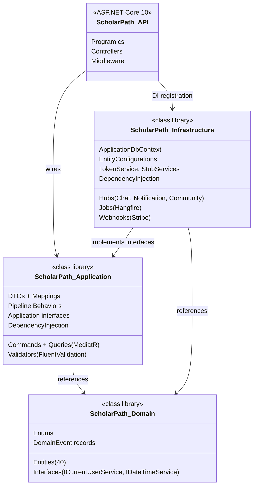
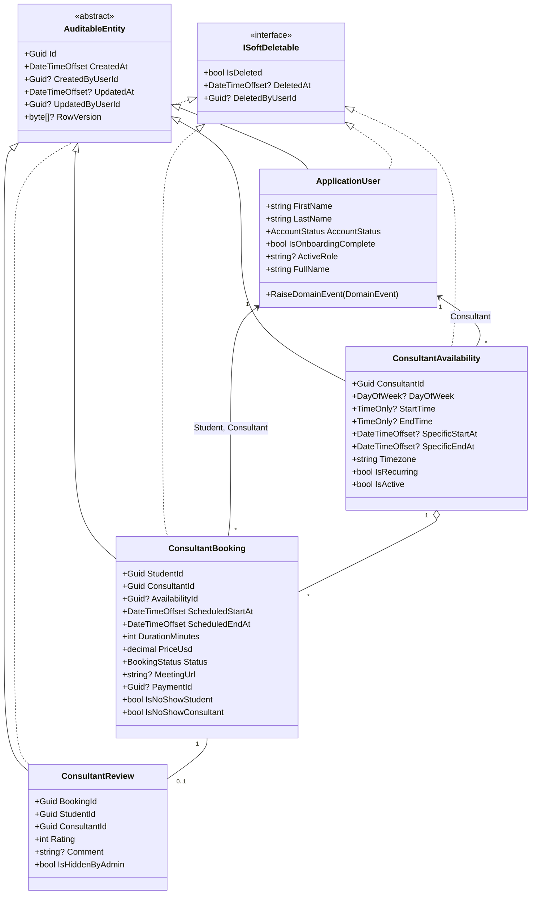
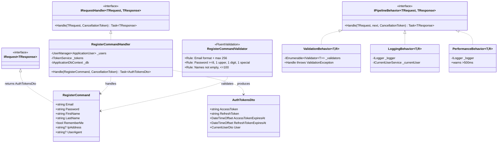
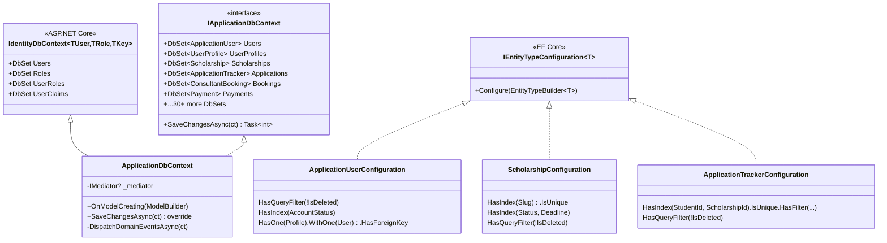
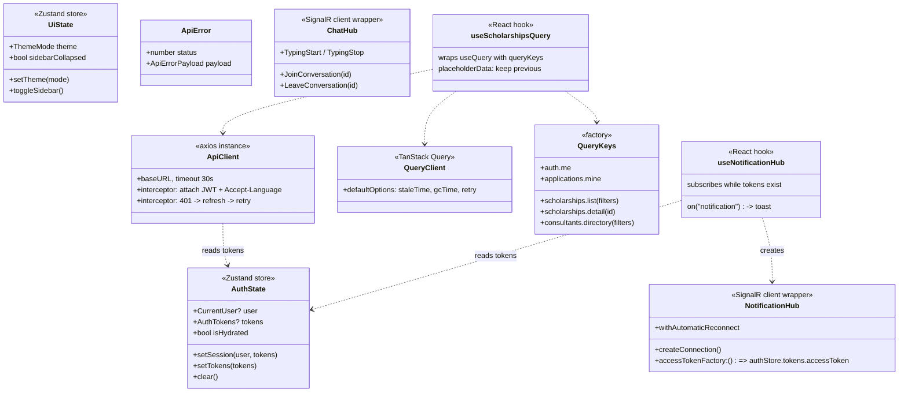

# Class Diagrams (UML)

Six class diagrams covering the key architectural groupings. Rendered natively by GitHub via Mermaid `classDiagram`.

## 1. Clean Architecture — project references

## 2. Domain aggregates (sample — Booking context)

## 3. CQRS vertical slice (Register example)

## 4. Infrastructure adapters (contract + impls)

```mermaid
classDiagram
  class ITokenService {
    <<interface>>
    +IssueTokens(user, roles, activeRole, rememberMe) TokenPair
    +RotateRefreshTokenAsync(refreshToken, ipAddress, userAgent, ct) Task~TokenPair?~
    +RevokeRefreshTokenAsync(refreshToken, reason, ct) Task
    +RevokeAllForUserAsync(userId, reason, ct) Task
  }
  class IStripeService {
    <<interface>>
    +CreatePaymentIntentAsync(amount, currency, captureMethod, metadata, idempotency, ct)
    +CapturePaymentIntentAsync(intentId, amount, idempotency, ct)
    +CancelPaymentIntentAsync(intentId, reason, idempotency, ct)
    +RefundPaymentAsync(intentId, amount, reason, idempotency, ct)
    +CreateConnectAccountAsync(email, country, ct)
    +CreatePayoutAsync(account, amount, currency, idempotency, ct)
    +ParseWebhook(payload, signatureHeader, secret) StripeWebhookParseResult
  }
  class IAiService {
    <<interface>>
    +GenerateRecommendationsAsync(userId, topN, ct) AiRecommendationResult
    +CheckEligibilityAsync(userId, scholarshipId, ct) AiEligibilityResult
    +AskAsync(userId, sessionId, message, ct) AiChatResponse
  }
  class IEmailService {
    <<interface>>
    +SendAsync(EmailMessage, ct) Task
  }
  class INotificationDispatcher {
    <<interface>>
    +DispatchAsync(recipientId, type, content, deepLink, idempotency, ct)
    +DispatchBroadcastAsync(recipients, type, content, ct)
  }
  class IAuditService {
    <<interface>>
    +WriteAsync(action, targetType, targetId, beforeJson, afterJson, summary, ct)
  }

  class TokenService {
    -JwtOptions _opts
    -ApplicationDbContext _db
    -IDateTimeService _clock
  }
  class StubStripeService {
    <<dev-only>>
    returns fake intent/charge IDs
  }
  class StubAiService {
    <<dev-only>>
    returns canned responses + disclaimer
  }
  class StubEmailService {
    logs to console (MailHog in dev)
  }
  class StubNotificationDispatcher {
    logs dispatch attempts
  }
  class StubAuditService {
    logs audit events
  }

  ITokenService <|.. TokenService
  IStripeService <|.. StubStripeService
  IAiService <|.. StubAiService
  IEmailService <|.. StubEmailService
  INotificationDispatcher <|.. StubNotificationDispatcher
  IAuditService <|.. StubAuditService
```

## 5. Persistence (DbContext + Identity integration)

## 6. Frontend architecture (stores + API + SignalR)

---

## How these diagrams map to code

| Diagram | Primary file(s) |
|---|---|
| 1. Clean Architecture projects | `server/ScholarPath.slnx`, the `.csproj` files |
| 2. Domain aggregates | `server/src/ScholarPath.Domain/Entities/*.cs`, `Common/BaseEntity.cs` |
| 3. CQRS vertical slice | `server/src/ScholarPath.Application/Auth/Commands/Register/*.cs` |
| 4. Infrastructure adapters | `server/src/ScholarPath.Application/Common/Interfaces/*.cs`, `server/src/ScholarPath.Infrastructure/Services/*.cs` |
| 5. Persistence | `server/src/ScholarPath.Infrastructure/Persistence/ApplicationDbContext.cs` + `Configurations/EntityConfigurations.cs` |
| 6. Frontend architecture | `client/src/stores/`, `client/src/services/api/`, `client/src/services/signalR/`, `client/src/hooks/` |

---

## Rendering

GitHub renders `classDiagram` natively inside `.md` files. If you need higher-quality exports for a printed defense booklet, paste the Mermaid blocks into https://mermaid.live and export as SVG/PNG.
