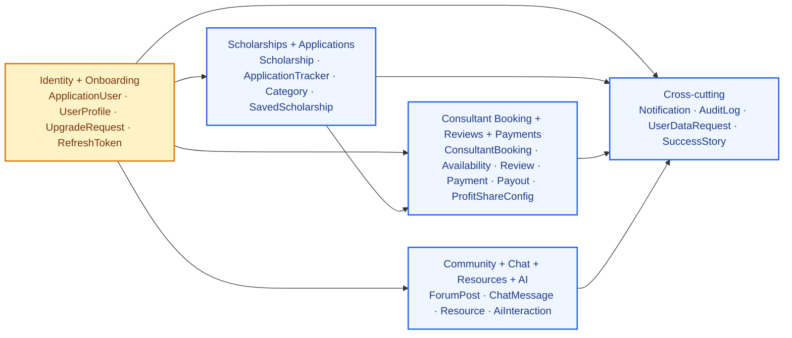
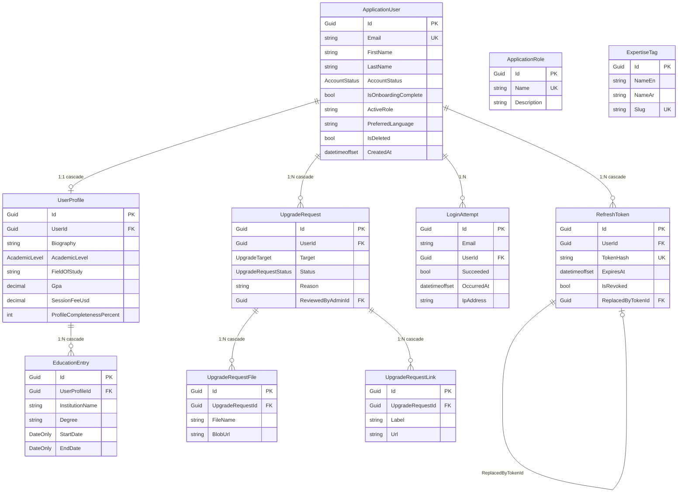
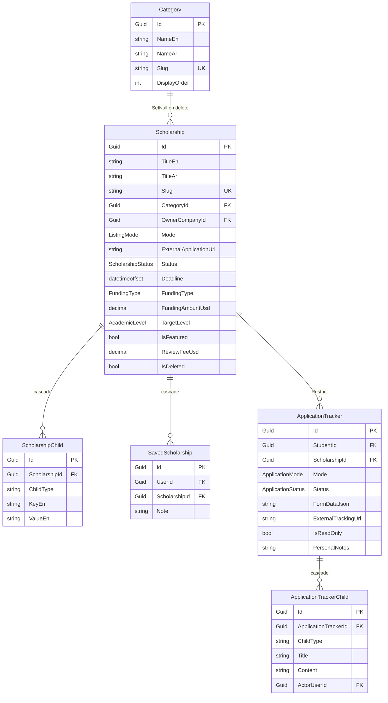
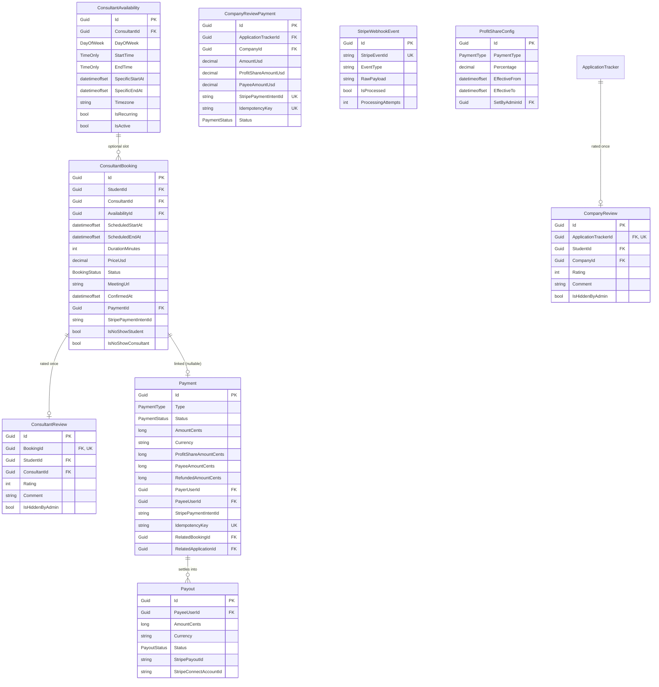
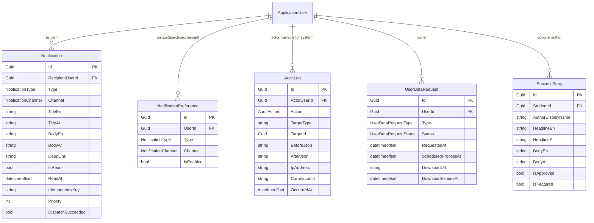
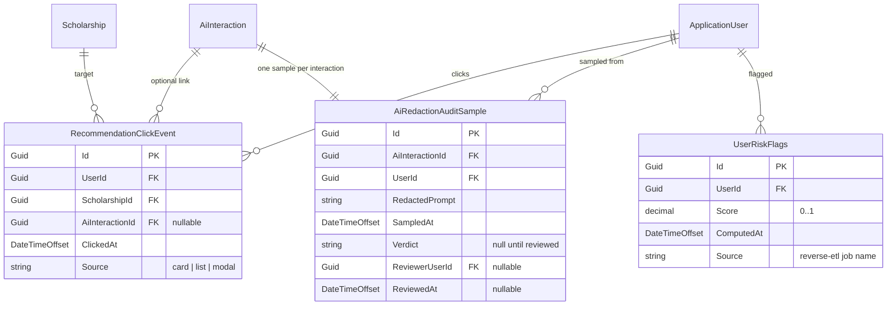

# Entity Relationship Diagram

Source of truth: the EF migration files under `server/src/ScholarPath.Infrastructure/Migrations/`. This page visualizes them using Mermaid (GitHub renders it natively).

40 entities grouped by bounded context.

## Bounded-context overview

A single 40-entity ER diagram hits GitHub's Mermaid render limit. We group the
schema into 5 bounded contexts, each diagrammed below. This overview shows how
those contexts relate to one another; `ApplicationUser` is the shared aggregate
root referenced by every context.



Detail diagrams below — one per context.

---

## Context view 1 — Identity + Onboarding



---

## Context view 2 — Scholarships + Applications



**Critical constraint** (FR-057 — Single-Active-Application rule):
```sql
CREATE UNIQUE INDEX IX_ApplicationTracker_StudentId_ScholarshipId_Active
  ON ApplicationTracker (StudentId, ScholarshipId)
  WHERE Status NOT IN ('Withdrawn', 'Rejected', 'Accepted');
```

---

## Context view 3 — Consultant booking + reviews + payments



---

## Context view 4 — Community + Chat + Resources + AI

```mermaid
erDiagram
  ForumCategory {
    Guid Id PK
    string NameEn
    string NameAr
    string Slug UK
    int DisplayOrder
  }
  ForumPost {
    Guid Id PK
    Guid AuthorId FK
    Guid CategoryId FK
    Guid ParentPostId FK
    string Title
    string BodyMarkdown
    PostModerationStatus ModerationStatus
    int UpvoteCount
    int DownvoteCount
    int FlagCount
    bool IsAutoHidden
  }
  ForumPostAttachment {
    Guid Id PK
    Guid ForumPostId FK
    string FileName
    string BlobUrl
  }
  ForumVote {
    Guid Id PK
    Guid ForumPostId FK
    Guid UserId FK
    VoteType VoteType
  }
  ForumFlag {
    Guid Id PK
    Guid ForumPostId FK
    Guid FlaggedByUserId FK
    string Reason
    bool IsValid
  }
  ChatConversation {
    Guid Id PK
    Guid ParticipantOneId FK
    Guid ParticipantTwoId FK
    datetimeoffset LastMessageAt
  }
  ChatMessage {
    Guid Id PK
    Guid ConversationId FK
    Guid SenderId FK
    string Body
    datetimeoffset SentAt
    datetimeoffset ReadAt
    bool IsDeleted
  }
  UserBlock {
    Guid Id PK
    Guid BlockerId FK
    Guid BlockedUserId FK
    string Reason
  }
  Resource {
    Guid Id PK
    string TitleEn
    string TitleAr
    string Slug UK
    string ContentMarkdownEn
    string ContentMarkdownAr
    Guid AuthorUserId FK
    string AuthorRole
    ResourceType Type
    ResourceStatus Status
    bool IsFeatured
  }
  ResourceChild {
    Guid Id PK
    Guid ResourceId FK
    string TitleEn
    string TitleAr
    int SortOrder
  }
  ResourceBookmark {
    Guid Id PK
    Guid UserId FK
    Guid ResourceId FK
  }
  ResourceProgress {
    Guid Id PK
    Guid UserId FK
    Guid ResourceId FK
    int ChaptersCompletedCount
  }
  ResourceProgressChild {
    Guid Id PK
    Guid ResourceProgressId FK
    Guid ResourceChildId FK
    bool IsCompleted
  }
  AiInteraction {
    Guid Id PK
    Guid UserId FK
    AiFeature Feature
    AiProvider Provider
    string ModelName
    string SessionId
    string PromptText
    string ResponseText
    int PromptTokens
    int CompletionTokens
    decimal CostUsd
  }

  ForumCategory ||--o{ ForumPost : "contains"
  ForumPost ||--o{ ForumPost : "replies"
  ForumPost ||--o{ ForumPostAttachment : "cascade"
  ForumPost ||--o{ ForumVote : "cascade, unique(post,user)"
  ForumPost ||--o{ ForumFlag : "cascade, unique(post,user)"
  ChatConversation ||--o{ ChatMessage : "cascade"
  Resource ||--o{ ResourceChild : "cascade"
  Resource ||--o{ ResourceBookmark : "unique(user,resource)"
  Resource ||--o{ ResourceProgress : "unique(user,resource)"
  ResourceProgress ||--o{ ResourceProgressChild : "unique(progress,child)"
```



---

## Context view 5 — Cross-cutting (Notifications, Audit, DataRequests)



---

## Context view 6 — Analytics layer (PB-015..PB-018)

The analytics entities introduced by Part V of the SRS. These live in the
OLTP database (same SQL Server) because they feed the existing
`[Auditable]` pipeline and are read by both the admin UI and the Gold
layer. The medallion / star schema warehouse lives in Azure Data Lake —
see `docs/ANALYTICS.md` for that side.



### Data model rules (Part V)

- `RecommendationClickEvent.AiInteractionId` may be null when a user clicks
  a recommendation from a cached set (no active AI call this session).
- `AiRedactionAuditSample.Verdict` uses the fixed set
  `{ clean, missed_email, missed_phone, missed_card }` and is `NULL`
  until a reviewer submits their verdict via the admin UI.
- `UserRiskFlags` is upsert-by-UserId — only the latest score is kept
  (older rows marked deleted via `IsDeleted` flag so the audit log sees
  the transition).
- All three tables are CDC-enabled and flow into Silver / Gold as
  `FactRecommendationClick`, `FactRedactionSample`, and
  `DimUserRiskSnapshot` respectively.

---

## Legend

| Notation | Meaning |
|---|---|
| `PK` | Primary key |
| `FK` | Foreign key |
| `UK` | Unique key / constraint |
| `\|\|--o{` | 1-to-many (zero-or-more) |
| `\|\|--o\|` | 1-to-0-or-1 |
| `}o--\|\|` | many-to-1 |
| `}o--o{` | many-to-many (we use join tables explicitly) |

---

## How to regenerate

The ERD is hand-written from the Domain entities. If you add an entity:

1. Add its class to `server/src/ScholarPath.Domain/Entities/`.
2. Add its `IEntityTypeConfiguration<T>` under `server/src/ScholarPath.Infrastructure/Persistence/Configurations/`.
3. Register the DbSet in `ApplicationDbContext` + `IApplicationDbContext`.
4. Run `dotnet ef migrations add <FeatureName> --project src/ScholarPath.Infrastructure --startup-project src/ScholarPath.API`.
5. Update this ERD file with the new entity and relationships.

To export SQL for the defense:
```bash
cd server
dotnet ef migrations script --project src/ScholarPath.Infrastructure --startup-project src/ScholarPath.API > ../docs/schema.sql
```
