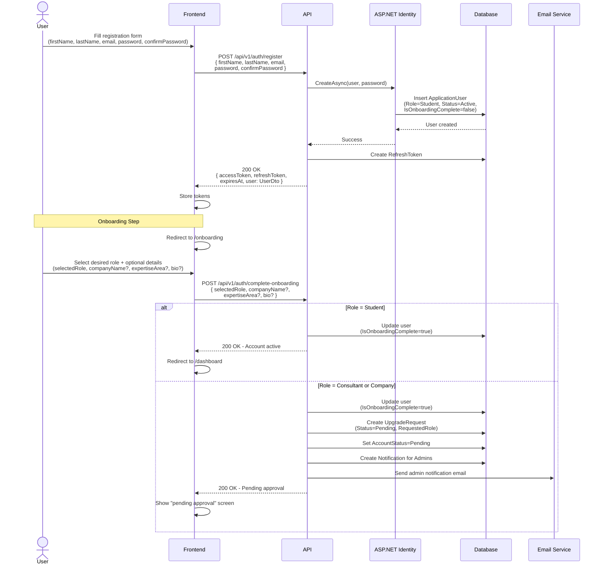
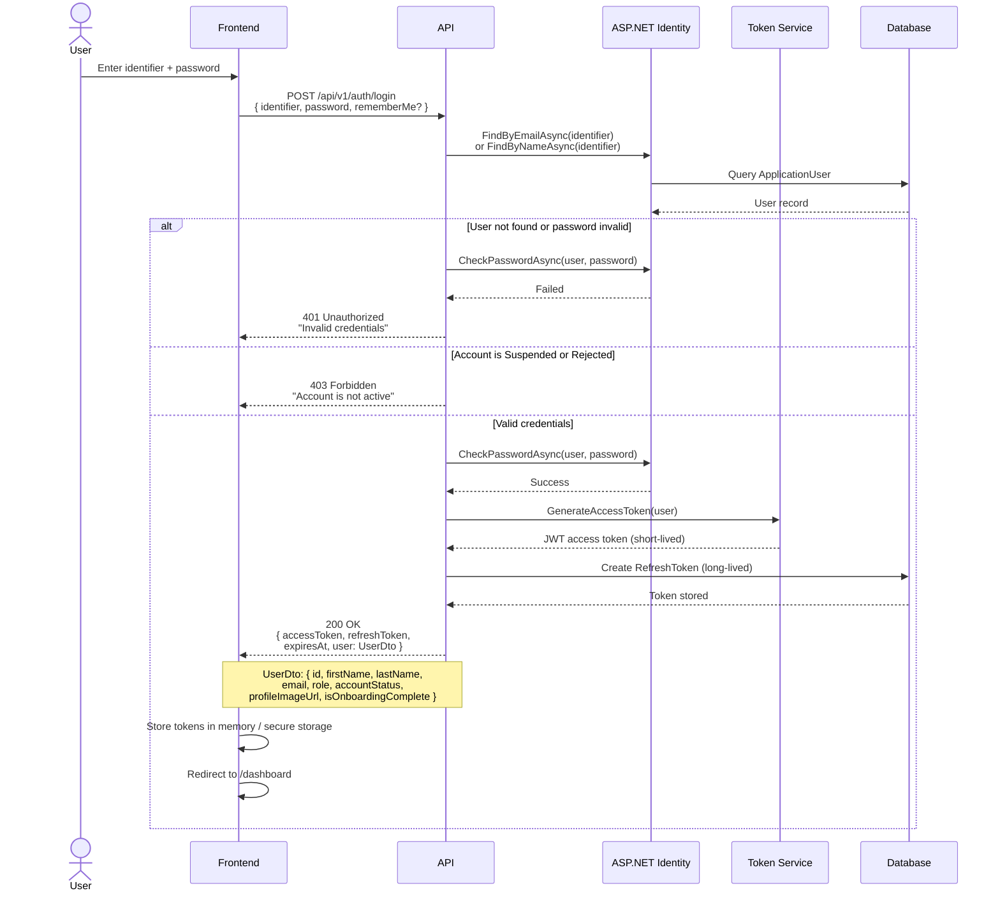
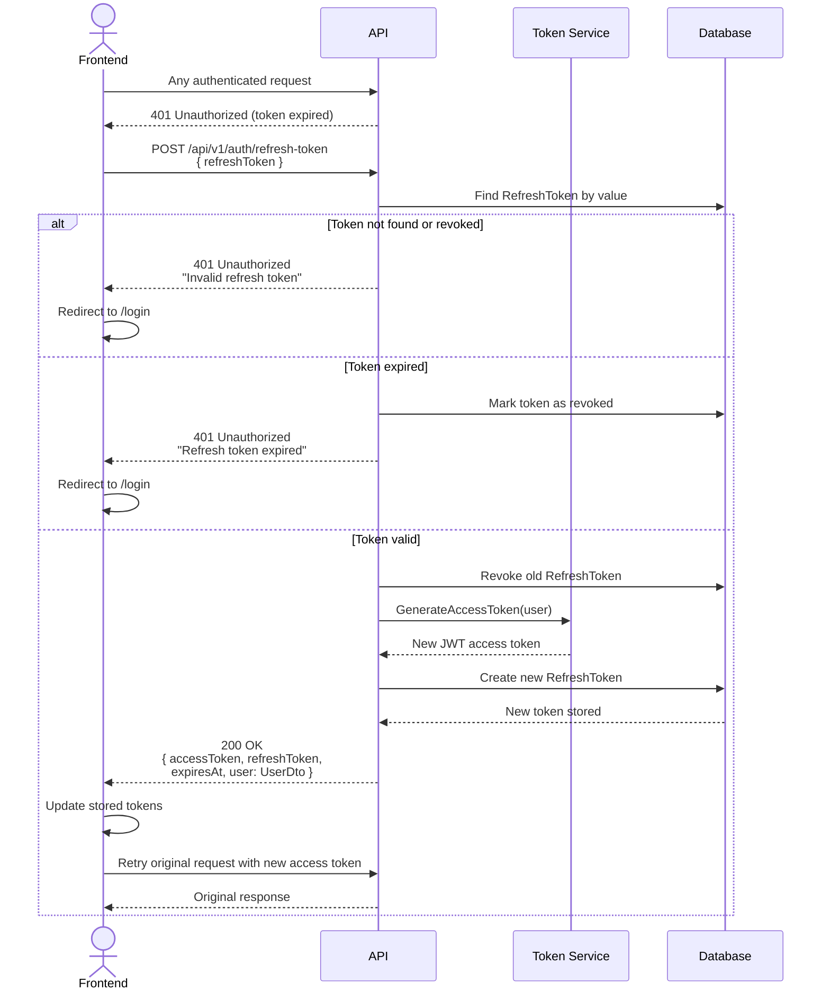
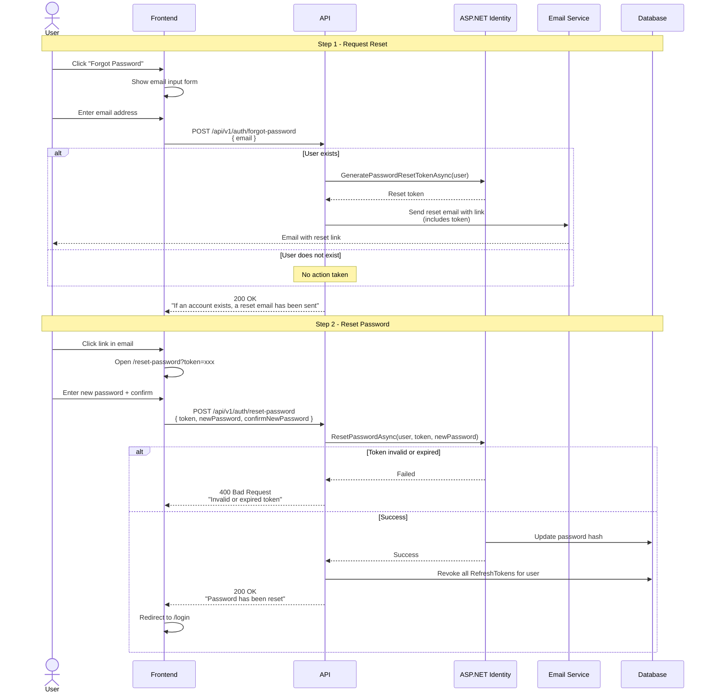
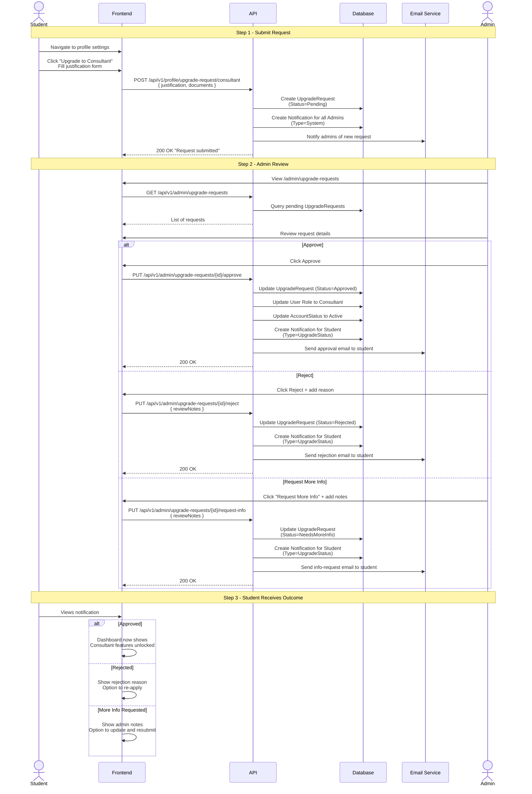

# ScholarPath Authentication and Authorization Flows

## Overview

ScholarPath uses JWT-based stateless authentication with refresh token rotation. ASP.NET Identity handles user management and password hashing. Authorization is role-based with four roles: Student, Consultant, Company, and Admin.

---

## 1. Registration and Onboarding Flow

New users register with first name, last name, email, and password. They then complete an onboarding step where they select their role. Students are activated immediately. Consultants and Companies require admin approval.

---

## 2. Login Flow

Users authenticate with an identifier (email or username) and password. The API validates credentials, generates a JWT access token and a refresh token, and returns both along with user details.

---

## 3. Token Refresh Flow

When the access token expires, the frontend sends the refresh token to obtain a new access token. The old refresh token is revoked and a new one is issued (rotation).

---

## 4. Password Reset Flow

Users request a password reset via email. The API always returns a generic success message to prevent email enumeration. If the user exists, a reset token is sent via email.

---

## 5. Role Upgrade Flow

Authenticated students can request an upgrade to Consultant or Company. Admins review the request and can approve, reject, or request more information.

---

## Token Configuration

| Parameter | Value | Notes |
|---|---|---|
| Access Token Lifetime | 60 minutes (default) | Short-lived for security |
| Refresh Token Lifetime | 7 days | Rotated on each use |
| Password Reset Token | 24 hours | Single use |
| JWT Signing Algorithm | HS256 | HMAC with symmetric key |
| Token Storage (Frontend) | Memory + httpOnly cookie | Prevents XSS access |

---

## Security Measures

| Measure | Implementation |
|---|---|
| Password Hashing | ASP.NET Identity (PBKDF2 with HMAC-SHA256) |
| Refresh Token Rotation | Old token revoked on each refresh |
| Email Enumeration Prevention | Generic responses on forgot-password and registration |
| Brute Force Protection | Account lockout after N failed attempts (ASP.NET Identity) |
| Token Revocation on Password Reset | All refresh tokens invalidated when password changes |
| Role-Based Authorization | `[Authorize(Roles = "Admin")]` attributes on protected endpoints |
| HTTPS Only | Enforced in production |
