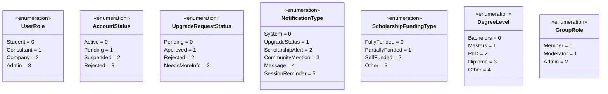

# ScholarPath Domain Class Diagram

## Overview

This document describes the domain model class hierarchy, interfaces, enumerations, and relationships between entities in ScholarPath.

---

## Class Hierarchy and Relationships

```mermaid
classDiagram
    class BaseEntity {
        <<abstract>>
        +Guid Id
        +DateTime CreatedAt
        +DateTime? UpdatedAt
    }

    class AuditableEntity {
        <<abstract>>
        +string? CreatedBy
        +string? UpdatedBy
    }

    class ISoftDeletable {
        <<interface>>
        +bool IsDeleted
        +DateTime? DeletedAt
        +string? DeletedBy
    }

    BaseEntity <|-- AuditableEntity

    class ApplicationUser {
        +string FirstName
        +string LastName
        +string? ProfileImageUrl
        +UserRole Role
        +AccountStatus AccountStatus
        +bool IsOnboardingComplete
        +DateTime CreatedAt
        +DateTime? LastLoginAt
        +bool IsActive
        +UserProfile? UserProfile
        +ICollection~RefreshToken~ RefreshTokens
        +ICollection~Notification~ Notifications
        +ICollection~UpgradeRequest~ UpgradeRequests
        +ICollection~SavedScholarship~ SavedScholarships
    }

    class UserProfile {
        +Guid UserId
        +string? FieldOfStudy
        +decimal? GPA
        +string? Interests
        +string? Country
        +string? TargetCountry
        +string? Bio
        +string? PhoneNumber
        +DateTime? DateOfBirth
        +ApplicationUser User
    }

    class RefreshToken {
        +string Token
        +DateTime ExpiresAt
        +string? CreatedByIp
        +DateTime? RevokedAt
        +string? RevokedByIp
        +string? ReplacedByToken
        +bool IsRevoked
        +bool IsExpired
        +Guid UserId
        +ApplicationUser User
    }

    class UpgradeRequest {
        +Guid UserId
        +UserRole RequestedRole
        +UpgradeRequestStatus Status
        +string? AdminNotes
        +string? RejectionReason
        +string? ReviewedBy
        +DateTime? ReviewedAt
        +string? ExperienceSummary
        +string? ExpertiseTags
        +string? Languages
        +string? LinkedInUrl
        +string? PortfolioUrl
        +string? CompanyName
        +string? CompanyCountry
        +string? CompanyWebsite
        +string? ContactPersonName
        +string? ContactEmail
        +string? ContactPhone
        +string? CompanyRegistrationNumber
        +string? ProofDocumentUrl
        +ApplicationUser User
    }

    class Scholarship {
        +string Title
        +string? TitleAr
        +string Description
        +string? DescriptionAr
        +string? Country
        +string? FieldOfStudy
        +ScholarshipFundingType FundingType
        +DegreeLevel DegreeLevel
        +decimal? AwardAmount
        +string? Currency
        +DateTime? Deadline
        +string? EligibilityDescription
        +string? RequiredDocuments
        +string? OfficialLink
        +string? ImageUrl
        +bool IsActive
        +decimal? MinGPA
        +int? MaxAge
        +string? EligibleCountries
        +string? EligibleMajors
        +Guid? CategoryId
        +Category? Category
        +ICollection~SavedScholarship~ SavedScholarships
    }

    class SavedScholarship {
        +Guid UserId
        +Guid ScholarshipId
        +ApplicationUser User
        +Scholarship Scholarship
    }

    class Category {
        +string Name
        +string? NameAr
        +string? Description
        +string? DescriptionAr
        +ICollection~Scholarship~ Scholarships
    }

    class Notification {
        +Guid UserId
        +NotificationType Type
        +string Title
        +string? TitleAr
        +string Message
        +string? MessageAr
        +bool IsRead
        +DateTime? ReadAt
        +Guid? RelatedEntityId
        +string? RelatedEntityType
        +ApplicationUser User
    }

    class Group {
        +string Name
        +string? NameAr
        +string? Description
        +string? DescriptionAr
        +Guid CreatorId
        +bool IsPrivate
        +int MaxMembers
        +string? ImageUrl
        +ApplicationUser Creator
        +ICollection~GroupMember~ Members
        +ICollection~Post~ Posts
    }

    class GroupMember {
        +Guid GroupId
        +Guid UserId
        +GroupRole Role
        +DateTime JoinedAt
        +Group Group
        +ApplicationUser User
    }

    class Post {
        +Guid GroupId
        +Guid AuthorId
        +string Content
        +string? ImageUrl
        +Group Group
        +ApplicationUser Author
        +ICollection~Comment~ Comments
        +ICollection~Like~ Likes
    }

    class Comment {
        +Guid PostId
        +Guid AuthorId
        +string Content
        +Guid? ParentCommentId
        +Post Post
        +ApplicationUser Author
        +Comment? ParentComment
        +ICollection~Comment~ Replies
    }

    class Like {
        +Guid UserId
        +Guid? PostId
        +Guid? CommentId
        +ApplicationUser User
        +Post? Post
        +Comment? Comment
    }

    class Message {
        +Guid SenderId
        +Guid? ReceiverId
        +Guid? GroupId
        +string Content
        +DateTime SentAt
        +bool IsRead
        +DateTime? ReadAt
        +ApplicationUser Sender
        +ApplicationUser? Receiver
        +Group? Group
    }

    class Resource {
        +string Title
        +string? TitleAr
        +string? Description
        +string? DescriptionAr
        +string Url
        +string? Type
        +string? Category
    }

    class SuccessStory {
        +Guid UserId
        +string Title
        +string? TitleAr
        +string Content
        +string? ContentAr
        +string? ImageUrl
        +bool IsApproved
        +DateTime? ApprovedAt
        +string? ApprovedBy
        +ApplicationUser User
    }

    %% Inheritance
    %% ApplicationUser inherits from IdentityUser~Guid~ (NOT BaseEntity)
    AuditableEntity <|-- UserProfile
    BaseEntity <|-- RefreshToken
    AuditableEntity <|-- UpgradeRequest
    AuditableEntity <|-- Scholarship
    BaseEntity <|-- SavedScholarship
    BaseEntity <|-- Category
    BaseEntity <|-- Notification
    AuditableEntity <|-- Group
    BaseEntity <|-- GroupMember
    AuditableEntity <|-- Post
    AuditableEntity <|-- Comment
    BaseEntity <|-- Like
    BaseEntity <|-- Message
    AuditableEntity <|-- Resource
    AuditableEntity <|-- SuccessStory

    %% Interface implementations
    ISoftDeletable <|.. Category : implements
    ISoftDeletable <|.. Scholarship : implements
    ISoftDeletable <|.. Group : implements
    ISoftDeletable <|.. Post : implements
    ISoftDeletable <|.. Comment : implements
    ISoftDeletable <|.. Message : implements
    ISoftDeletable <|.. Resource : implements
    ISoftDeletable <|.. SuccessStory : implements

    %% Associations
    ApplicationUser "1" --> "0..1" UserProfile : has
    ApplicationUser "1" --> "*" RefreshToken : owns
    ApplicationUser "1" --> "*" UpgradeRequest : submits
    ApplicationUser "1" --> "*" SavedScholarship : saves
    ApplicationUser "1" --> "*" Notification : receives
    ApplicationUser "1" --> "*" Group : creates
    ApplicationUser "1" --> "*" GroupMember : joins
    ApplicationUser "1" --> "*" Post : authors
    ApplicationUser "1" --> "*" Comment : writes
    ApplicationUser "1" --> "*" Like : gives
    ApplicationUser "1" --> "*" Message : sends
    ApplicationUser "1" --> "*" SuccessStory : shares

    Category "1" --> "*" Scholarship : categorizes
    Scholarship "1" --> "*" SavedScholarship : saved as
    Group "1" --> "*" GroupMember : includes
    Group "1" --> "*" Post : contains
    Post "1" --> "*" Comment : has
    Post "1" --> "*" Like : liked via
    Comment "1" --> "*" Comment : replies
```

---

## Enumerations

---

## Domain Interfaces

```mermaid
classDiagram
    class IRepository~T~ {
        <<interface>>
        +GetByIdAsync(Guid id, CancellationToken) Task~T?~
        +GetAllAsync(CancellationToken) Task~IReadOnlyList~T~~
        +FindAsync(Expression~Func~T bool~~ predicate, CancellationToken) Task~IReadOnlyList~T~~
        +GetPagedAsync(int page, int pageSize, Expression~Func~T bool~~? predicate, Expression~Func~T object~~? orderBy, bool descending, CancellationToken) Task~(IReadOnlyList~T~ Items, int TotalCount)~
        +AddAsync(T entity, CancellationToken) Task~T~
        +Update(T entity) void
        +Delete(T entity) void
        +CountAsync(Expression~Func~T bool~~? predicate, CancellationToken) Task~int~
    }

    class IUnitOfWork {
        <<interface>>
        +SaveChangesAsync(CancellationToken) Task~int~
        +BeginTransactionAsync(CancellationToken) Task
        +CommitTransactionAsync(CancellationToken) Task
        +RollbackTransactionAsync(CancellationToken) Task
    }

    class ITokenService {
        <<interface>>
        +GenerateAccessToken(ApplicationUser user) Task~string~
        +GenerateRefreshToken() string
        +ValidateRefreshToken(string token) Task~bool~
    }

    class ICurrentUserService {
        <<interface>>
        +string? UserId
        +UserRole? UserRole
        +bool IsAuthenticated
    }

    class IEmailService {
        <<interface>>
        +SendEmailAsync(string to, string subject, string htmlBody, CancellationToken) Task
        +SendPasswordResetEmailAsync(string to, string resetLink, CancellationToken) Task
        +SendUpgradeStatusEmailAsync(string to, string status, string? reason, CancellationToken) Task
    }

    class ICachingService {
        <<interface>>
        +GetAsync~T~(string key, CancellationToken) Task~T?~
        +SetAsync~T~(string key, T value, TimeSpan? expiry, CancellationToken) Task
        +RemoveAsync(string key, CancellationToken) Task
        +ExistsAsync(string key, CancellationToken) Task~bool~
    }

    IUnitOfWork --|> IDisposable : extends
```

---

## Inheritance Summary

| Entity | Inherits From | Implements |
|---|---|---|
| ApplicationUser | IdentityUser\<Guid\> | -- |
| UserProfile | AuditableEntity | -- |
| RefreshToken | BaseEntity | -- |
| UpgradeRequest | AuditableEntity | -- |
| Scholarship | AuditableEntity | ISoftDeletable |
| SavedScholarship | BaseEntity | -- |
| Category | BaseEntity | ISoftDeletable |
| Notification | BaseEntity | -- |
| Group | AuditableEntity | ISoftDeletable |
| GroupMember | BaseEntity | -- |
| Post | AuditableEntity | ISoftDeletable |
| Comment | AuditableEntity | ISoftDeletable |
| Like | BaseEntity | -- |
| Message | BaseEntity | ISoftDeletable |
| Resource | AuditableEntity | ISoftDeletable |
| SuccessStory | AuditableEntity | ISoftDeletable |

---

## Design Notes

- **ApplicationUser** inherits from `IdentityUser<Guid>` (not `BaseEntity` or `AuditableEntity`). It defines its own `CreatedAt` and `LastLoginAt` fields, plus Identity-provided fields (`UserName`, `Email`, `PasswordHash`, `PhoneNumber`, etc.).
- **BaseEntity** provides identity (`Id`) and timestamps (`CreatedAt`, `UpdatedAt`) for all domain entities.
- **AuditableEntity** extends BaseEntity with nullable `CreatedBy` and `UpdatedBy` fields for entities that require user-level audit trails.
- **ISoftDeletable** is implemented by entities that should never be physically deleted from the database. A global query filter in EF Core automatically excludes soft-deleted records. Implementing entities: Category, Scholarship, Group, Post, Comment, Message, Resource, SuccessStory.
- **RefreshToken** has computed properties `IsRevoked` (derived from `RevokedAt is not null`) and `IsExpired` (derived from `DateTime.UtcNow >= ExpiresAt`) — these are not stored columns.
- **Polymorphic Like**: The `Like` entity can target either a `Post` or a `Comment`. Exactly one of `PostId` or `CommentId` must be non-null.
- **Polymorphic Message**: The `Message` entity supports both direct messages (`ReceiverId` set) and group messages (`GroupId` set). It also has `SentAt` and `ReadAt` timestamps.
- **Resource** has no foreign key relationships or navigation properties to other entities — it is a standalone content entity.
- **UpgradeRequest** contains role-specific fields: consultant fields (`ExperienceSummary`, `ExpertiseTags`, `Languages`, `LinkedInUrl`, `PortfolioUrl`) and company fields (`CompanyName`, `CompanyCountry`, `CompanyWebsite`, `ContactPersonName`, `ContactEmail`, `ContactPhone`, `CompanyRegistrationNumber`). The `ReviewedBy` field is a `string?` (not a `Guid?` FK).
- Several entities support bilingual content with Arabic-language fields: `TitleAr`, `DescriptionAr`, `NameAr`, `ContentAr`, `MessageAr`.
- **IRepository\<T\>** is constrained to `where T : BaseEntity`, meaning it cannot be used directly for `ApplicationUser`.
