# ScholarPath — Redrawn Diagrams (Gap-Closure)

**Date:** 2026-05-24
**Companion to:** `DIAGRAMS-GAP-ANALYSIS.md` (in the same folder).

These versions of the four diagrams are reverse-engineered from the live code as of this commit and close the gaps listed in the gap analysis (`C1`–`C9`, `E1`–`E8`, `R1`–`R8`, `D1`–`D9`).

**Format note.** The originals were LaTeX → DOCX, rendered in Chen / Sommerville notation. These are written in **Mermaid** so they render natively in GitHub and can be exported as SVG/PNG by pasting any code block into [mermaid.live](https://mermaid.live). Mermaid's ER notation is **crow's-foot** (not Chen) — semantically equivalent for cardinality. The class and component diagrams use Mermaid's `classDiagram` / `flowchart`, which are close enough to Sommerville UML.

---

## Section 1 — Component Diagram (redrawn)

**Closes:** `D1` (Hangfire annotated optional), `D2` (SsoService added), `D3` (key-provider ports split out), `D4` (OpenAI-direct adapter added), `D5` (recommend-via-local annotated), `D6` (email config switch), `D7` (Power BI bidirectional), `D8` (ASP.NET Identity surfaced), `D9` (MemoryCache shown).

```mermaid
flowchart TB
    classDef ext fill:#ffe7c2,stroke:#c47f00,color:#000
    classDef cli fill:#cfe2ff,stroke:#2c4f9b,color:#000
    classDef api fill:#bcd4ff,stroke:#2c4f9b,color:#000
    classDef app fill:#d4e4d4,stroke:#3b6f3b,color:#000
    classDef dom fill:#f5f5f5,stroke:#666,color:#000
    classDef inf fill:#f3d7f3,stroke:#6a3f6a,color:#000
    classDef opt fill:#fffde0,stroke:#aa9400,color:#000,stroke-dasharray:5 3

    %% ── Client tier ───────────────────────────────────────────
    subgraph SWA["Azure Static Web Apps"]
        SPA["React 19 SPA"]:::cli
    end

    %% ── API tier ──────────────────────────────────────────────
    subgraph APPSVC["Azure App Service (Linux) — Monolith"]
        subgraph API["ScholarPath.API"]
            Ctrl["Controllers<br/>(REST + Stripe webhook receiver)"]:::api
            Auth["ASP.NET Core Identity<br/>+ JWT Bearer middleware"]:::api
            ChatH["ChatHub<br/>/hubs/chat"]:::api
            NotifH["NotificationHub<br/>/hubs/notifications"]:::api
            CommH["CommunityHub<br/>/hubs/community"]:::api
            HF["Hangfire Jobs<br/>«optional · Hangfire:Enabled»"]:::opt
        end

        subgraph APP["ScholarPath.Application<br/>(CQRS via MediatR — defines ports)"]
            UC["Commands + Queries + Validators<br/>+ Notification catalog<br/>+ AiCostGate"]:::app
        end

        subgraph DOM["ScholarPath.Domain"]
            EN["Entities · Enums · DomainEvents<br/>+ ICurrentUserService · IDateTimeService"]:::dom
        end

        subgraph INF["ScholarPath.Infrastructure (adapters that implement ports)"]
            EF["ApplicationDbContext<br/>(EF Core · IApplicationDbContext)"]:::inf
            Token["TokenService<br/>(ITokenService → JWT signer)"]:::inf
            PwdH["IdentityPasswordHasher<br/>(IPasswordHasher)"]:::inf
            Sso["SsoService / StubSsoService<br/>(ISsoService)"]:::inf
            EmailV["EmailVerificationService<br/>(IEmailVerificationService)"]:::inf
            Stripe["StripeService / StubStripeService<br/>(IStripeService)"]:::inf
            Acs["AzureCommunicationMeetingService /<br/>StubMeetingService (IMeetingService)"]:::inf
            Mail["MailKitEmailService / StubEmailService<br/>(IEmailService — Email:Provider switch)"]:::inf
            Blob["FileStorageService<br/>(IBlobStorageService — Storage:Provider)"]:::inf
            Scan["ClamAvFileScanService / NoOpFileScanService<br/>(IFileScanService)"]:::inf
            AiSvc["AzureOpenAi / OpenAi / LocalAiService<br/>(IAiService — Ai:Provider switch)"]:::inf
            Emb["AzureOpenAiEmbed / OpenAiEmbed /<br/>LocalEmbeddingService (IEmbeddingService)"]:::inf
            RAG["KnowledgeRetriever + KnowledgeBaseIndexer<br/>+ EmbeddedDatasetProvider"]:::inf
            EH["EventHubPublisher / StubEventPublisher<br/>(IEventPublisher)"]:::inf
            PBI["PowerBiService / StubPowerBiService<br/>(IPowerBiService)"]:::inf
            FE["AesGcmFieldEncryptionService<br/>(IFieldEncryptionService)"]:::inf
            FEKey["KeyVaultFieldEncryptionKeyProvider /<br/>LocalFieldEncryptionKeyProvider"]:::inf
            JWTKey["KeyVaultJwtKeyProvider /<br/>LocalJwtKeyProvider (IJwtKeyProvider)"]:::inf
            Notif["NotificationDispatcher<br/>(INotificationDispatcher: in-app + email + SignalR)"]:::inf
            ChatRT["ChatRealtimeNotifier · CommunityRealtimeNotifier<br/>+ PresenceTracker"]:::inf
            ReadSvc["AdminReadService · ConsultantReadService ·<br/>ChatContactReadService · UserAdministration"]:::inf
            Audit["AuditService<br/>(IAuditService)"]:::inf
            Cache["IMemoryCache<br/>«planned: Redis swap»"]:::opt
        end
    end

    %% ── External systems ──────────────────────────────────────
    SqlExt[("Azure SQL<br/>Database")]:::ext
    BlobExt[("Azure Blob<br/>Storage")]:::ext
    StripeExt(["Stripe<br/>(PaymentIntents · Connect)"]):::ext
    AcsExt(["Azure Communication<br/>Services (video + recording)"]):::ext
    SmtpExt(["SMTP mail<br/>server"]):::ext
    ClamExt(["ClamAV<br/>daemon"]):::ext
    OAIExt(["Azure OpenAI<br/>(gpt-4o-mini + embeddings)"]):::ext
    OAIDirExt(["OpenAI direct<br/>(chat + embeddings)"]):::ext
    EHExt(["Azure Event<br/>Hub"]):::ext
    PBIExt(["Power BI<br/>(embed + dataflow)"]):::ext
    KVExt(["Azure Key Vault"]):::ext
    GExt(["Google OAuth"]):::ext
    MSExt(["Microsoft OAuth"]):::ext

    %% ── Client → API ──────────────────────────────────────────
    SPA -- "HTTPS / REST + JWT" --> Ctrl
    SPA -. "WebSocket" .-> ChatH
    SPA -. "WebSocket" .-> NotifH
    SPA -. "WebSocket" .-> CommH

    %% ── Clean-Architecture dependency direction ───────────────
    API --> APP
    APP --> DOM
    INF --> APP
    INF --> DOM

    %% ── Adapter → external integrations ───────────────────────
    EF --> SqlExt
    Stripe -- "create / capture / refund" --> StripeExt
    StripeExt -- "webhook" --> Ctrl
    Acs --> AcsExt
    Mail --> SmtpExt
    Blob --> BlobExt
    Scan --> ClamExt
    AiSvc --> OAIExt
    AiSvc --> OAIDirExt
    Emb --> OAIExt
    Emb --> OAIDirExt
    EH --> EHExt
    EHExt --> PBIExt
    PBI -. "embed tokens" .-> PBIExt
    PBIExt == "reverse-ETL<br/>writes UserRiskFlags" ==> SqlExt
    FEKey --> KVExt
    JWTKey --> KVExt
    Sso --> GExt
    Sso --> MSExt
```

**Notes on the redraw:**

- **Hangfire** is annotated `«optional»` (dashed yellow). It only registers if `Hangfire:Enabled=true` (see `server/src/ScholarPath.API/Program.cs:196-221`).
- **Three AI providers** are shown — `Ai:Provider` selects one of `AzureOpenAi`, `OpenAi`, or `Stub` (see `DependencyInjection.cs:240-290`). Same pattern for embeddings.
- **`IFieldEncryptionKeyProvider`** and **`IJwtKeyProvider`** are surfaced as their own ports — both have a Key Vault and a local-dev adapter, and they sit between the in-memory service and Key Vault.
- **`ISsoService`** is on the diagram — it goes out to Google + Microsoft OAuth (the original diagram missed this).
- **Power BI** arrow is now bidirectional (embed-tokens for the API, reverse-ETL into `UserRiskFlags`).
- **`IMemoryCache`** is shown as `«planned»` since the code comments mention a Redis swap.

---

## Section 2 — Class Diagrams (redrawn)

**Closes:** `C1` (ApplicationUser inheritance fixed), `C2` (ports & adapters complete), `C3` (OpenAI-direct adapter), `C4` (stub adapters labelled), `C5` (missing entities added), `C6` (UpgradeRequest children), `C7` (FullName as `/derived`).

> All `AuditableEntity` subclasses are `: BaseEntity` transitively; soft-deletable ones also implement `ISoftDeletable`. To keep each figure legible, the base hierarchy is only drawn in §2.1 and implied elsewhere.

### 2.1 Base entity types

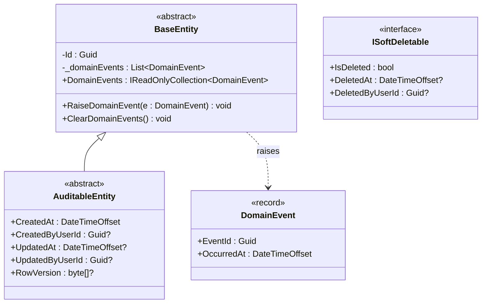

### 2.2 Identity & Profile

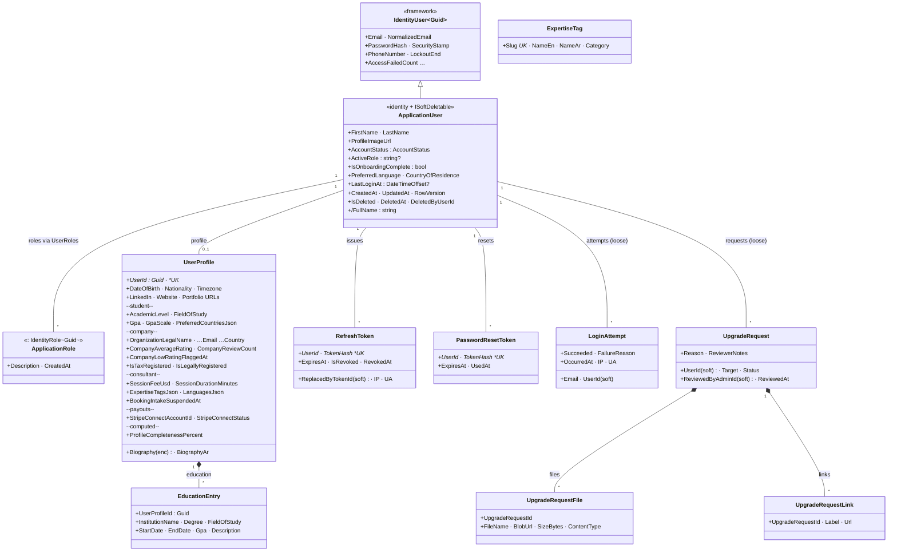

### 2.3 Scholarships, Applications & Documents

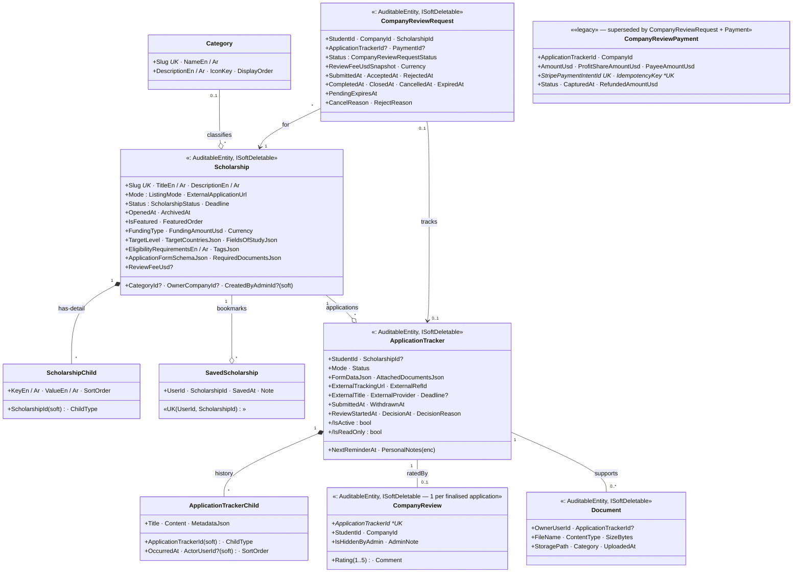

### 2.4 Booking, Payments & Ratings

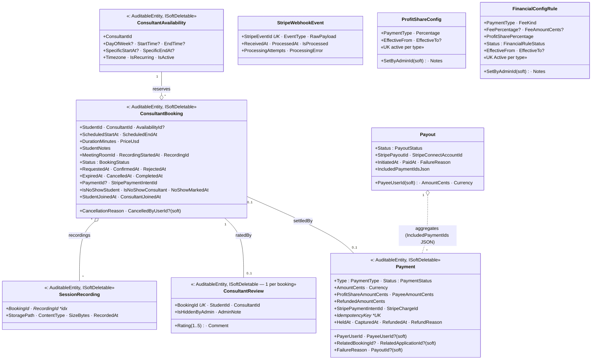

### 2.5 Community & Chat

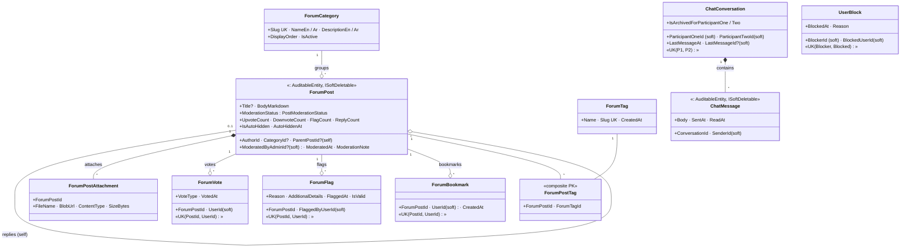

### 2.6 Resources Hub & Notifications

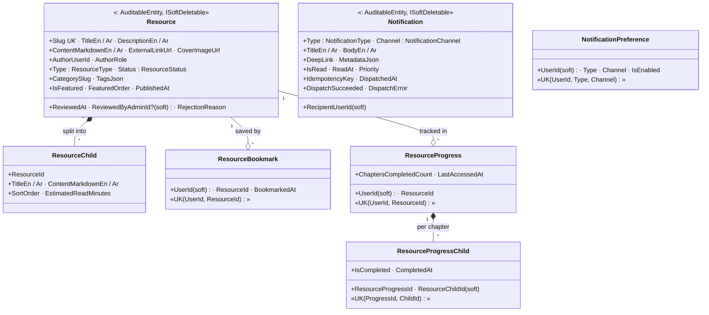

### 2.7 AI, Knowledge, Platform & Cross-cutting

```mermaid
classDiagram
    direction TB
    class AiInteraction {
        <<: AuditableEntity>>
        +UserId (soft) · Feature : AiFeature
        +Provider : AiProvider · ModelName · SessionId
        +PromptText · ResponseText
        +PromptTokens · CompletionTokens · CostUsd
        +MetadataJson · StartedAt · CompletedAt · ErrorMessage
    }
    class RecommendationClickEvent {
        +UserId · ScholarshipId · AiInteractionId?
        +ClickedAt · Source
    }
    class AiRedactionAuditSample {
        +AiInteractionId *UK* · UserId · ReviewerUserId?
        +RedactedPrompt · SampledAt
        +Verdict? : RedactionVerdict · ReviewedAt?
    }
    class KnowledgeDocument {
        <<: AuditableEntity>>
        +SourceType : KnowledgeSourceType
        +SourceId? (soft, polymorphic) · SourceKey
        +TitleEn / Ar · ContentEn / Ar · ContentHash
        +Embedding : byte[] · EmbeddingDimensions · EmbeddingModel
        +IndexedAt · MetadataJson
        +/IsEmbedded : bool
        «UK (SourceType, SourceKey)»
    }
    class AuditLog {
        +ActorUserId? (soft) · Action : AuditAction
        +TargetType · TargetId? (soft, polymorphic)
        +BeforeJson · AfterJson
        +IpAddress · UserAgent · OccurredAt
        +CorrelationId · Summary
    }
    class UserDataRequest {
        <<: AuditableEntity>>
        +UserId (soft) · Type · Status
        +RequestedAt · ScheduledProcessAt
        +CompletedAt · CancelledAt
        +DownloadUrl · DownloadExpiresAt · FailureReason
    }
    class SuccessStory {
        <<: AuditableEntity, ISoftDeletable>>
        +StudentId? (soft) · AuthorDisplayName · AuthorImageUrl
        +HeadlineEn / Ar · BodyEn / Ar
        +ScholarshipNameEn / Ar · CountryCode
        +IsApproved · IsFeatured · FeaturedOrder
    }
    class UserRiskFlag {
        +UserId *UK* · Score (0..1)
        +IsAtRisk · Reason · ComputedAt
        +SourceRefreshId? (soft)
    }
    class PlatformSetting {
        <<: AuditableEntity>>
        +Key *UK* · Value · ValueType : PlatformSettingType
        +DescriptionEn / Ar · Category
        +UpdatedByAdminId? (soft)
    }

    AiInteraction "1" -- "0..1" AiRedactionAuditSample : sampled
    AiInteraction "1" --o "*" RecommendationClickEvent : ai-attributed
```

### 2.8 Ports & Adapters (Clean Architecture seam)

> Closes `C2`, `C3`, `C4`. Adapters in italics under each port row; stub / dev fall-back is shown in **bold-italic**.

```mermaid
classDiagram
    direction LR

    %% ── Persistence ──
    class IApplicationDbContext {
        <<port>>
        +Database
        +Users · UserProfiles · Scholarships · …
        +SaveChangesAsync()
    }
    class ApplicationDbContext {
        <<adapter — EF Core + Azure SQL>>
    }
    IApplicationDbContext <|.. ApplicationDbContext

    %% ── Auth / Identity ──
    class ITokenService {
        <<port>>
        +IssueTokens()
        +RotateRefreshTokenAsync()
        +RevokeRefreshTokenAsync()
        +RevokeAllForUserAsync()
    }
    class TokenService {
        <<adapter — JWT signer>>
    }
    ITokenService <|.. TokenService

    class IPasswordHasher {
        <<port>>
    }
    class IdentityPasswordHasher {
        <<adapter — ASP.NET Identity hasher>>
    }
    IPasswordHasher <|.. IdentityPasswordHasher

    class ISsoService {
        <<port>>
        +ExchangeGoogleCodeAsync()
        +ExchangeMicrosoftCodeAsync()
        +BuildGoogleAuthorizeUrl()
        +BuildMicrosoftAuthorizeUrl()
    }
    class SsoService {
        <<adapter — real OAuth>>
    }
    class StubSsoService {
        <<«dev stub»>>
    }
    ISsoService <|.. SsoService
    ISsoService <|.. StubSsoService

    class IEmailVerificationService {
        <<port — Identity confirm tokens>>
    }
    class EmailVerificationService {
        <<adapter>>
    }
    IEmailVerificationService <|.. EmailVerificationService

    class IEmailChangeService {
        <<port>>
    }
    class EmailChangeService {
        <<adapter>>
    }
    IEmailChangeService <|.. EmailChangeService

    %% ── External money / video / mail ──
    class IStripeService {
        <<port>>
        +CreatePaymentIntent()
        +Capture() · Refund()
    }
    class StripeService {
        <<adapter — Stripe Connect>>
    }
    class StubStripeService {
        <<«dev stub»>>
    }
    IStripeService <|.. StripeService
    IStripeService <|.. StubStripeService

    class IMeetingService {
        <<port>>
    }
    class AzureCommunicationMeetingService {
        <<adapter — ACS>>
    }
    class StubMeetingService {
        <<«dev stub»>>
    }
    IMeetingService <|.. AzureCommunicationMeetingService
    IMeetingService <|.. StubMeetingService

    class IEmailService {
        <<port>>
    }
    class MailKitEmailService {
        <<adapter — SMTP>>
    }
    class StubEmailService {
        <<«dev stub»>>
    }
    IEmailService <|.. MailKitEmailService
    IEmailService <|.. StubEmailService

    %% ── Storage / scan ──
    class IBlobStorageService {
        <<port>>
        +UploadAsync() · DeleteAsync()
        +DownloadAsync()
    }
    class FileStorageService {
        <<adapter — Azure Blob / Local · Storage:Provider>>
    }
    IBlobStorageService <|.. FileStorageService

    class IFileScanService {
        <<port>>
    }
    class ClamAvFileScanService {
        <<adapter — clamd>>
    }
    class NoOpFileScanService {
        <<«dev / FileScanning:Enabled=false»>>
    }
    IFileScanService <|.. ClamAvFileScanService
    IFileScanService <|.. NoOpFileScanService

    %% ── AI + embeddings + RAG ──
    class IAiService {
        <<port>>
        +Recommend()
        +CheckEligibility()
        +Ask()
    }
    class AzureOpenAiService {
        <<adapter>>
    }
    class OpenAiService {
        <<adapter — OpenAI direct>>
    }
    class LocalAiService {
        <<«deterministic offline»>>
    }
    IAiService <|.. AzureOpenAiService
    IAiService <|.. OpenAiService
    IAiService <|.. LocalAiService

    class IEmbeddingService {
        <<port>>
    }
    class AzureOpenAiEmbeddingService {
        <<adapter>>
    }
    class OpenAiEmbeddingService {
        <<adapter>>
    }
    class LocalEmbeddingService {
        <<«local-hash»>>
    }
    IEmbeddingService <|.. AzureOpenAiEmbeddingService
    IEmbeddingService <|.. OpenAiEmbeddingService
    IEmbeddingService <|.. LocalEmbeddingService

    class IKnowledgeRetriever {
        <<port — RAG read side>>
    }
    class IKnowledgeBaseIndexer {
        <<port — RAG write side>>
    }
    class IDatasetProvider {
        <<port — bundled corpora>>
    }
    class KnowledgeRetriever {
        <<adapter>>
    }
    class KnowledgeBaseIndexer {
        <<adapter>>
    }
    class EmbeddedDatasetProvider {
        <<adapter>>
    }
    IKnowledgeRetriever <|.. KnowledgeRetriever
    IKnowledgeBaseIndexer <|.. KnowledgeBaseIndexer
    IDatasetProvider <|.. EmbeddedDatasetProvider

    %% ── Encryption + keys ──
    class IFieldEncryptionService {
        <<port>>
    }
    class AesGcmFieldEncryptionService {
        <<adapter — AES-256-GCM>>
    }
    IFieldEncryptionService <|.. AesGcmFieldEncryptionService

    class IFieldEncryptionKeyProvider {
        <<port>>
    }
    class KeyVaultFieldEncryptionKeyProvider {
        <<adapter — Azure Key Vault>>
    }
    class LocalFieldEncryptionKeyProvider {
        <<«dev»>>
    }
    IFieldEncryptionKeyProvider <|.. KeyVaultFieldEncryptionKeyProvider
    IFieldEncryptionKeyProvider <|.. LocalFieldEncryptionKeyProvider

    class IJwtKeyProvider {
        <<port>>
    }
    class KeyVaultJwtKeyProvider {
        <<adapter — Azure Key Vault>>
    }
    class LocalJwtKeyProvider {
        <<«dev / PEM»>>
    }
    IJwtKeyProvider <|.. KeyVaultJwtKeyProvider
    IJwtKeyProvider <|.. LocalJwtKeyProvider

    %% ── Eventing / BI ──
    class IEventPublisher {
        <<port>>
    }
    class EventHubPublisher {
        <<adapter — Azure Event Hub>>
    }
    class StubEventPublisher {
        <<«dev stub»>>
    }
    IEventPublisher <|.. EventHubPublisher
    IEventPublisher <|.. StubEventPublisher

    class IPowerBiService {
        <<port>>
    }
    class PowerBiService {
        <<adapter>>
    }
    class StubPowerBiService {
        <<«dev stub»>>
    }
    IPowerBiService <|.. PowerBiService
    IPowerBiService <|.. StubPowerBiService

    %% ── Notifications + realtime ──
    class INotificationDispatcher {
        <<port — in-app + email + SignalR>>
    }
    class NotificationDispatcher {
        <<adapter>>
    }
    INotificationDispatcher <|.. NotificationDispatcher

    class IChatRealtimeNotifier {
        <<port>>
    }
    class IChatPresenceQuery {
        <<port>>
    }
    class ICommunityRealtimeNotifier {
        <<port>>
    }
    class ChatRealtimeNotifier {
        <<adapter — SignalR ChatHub>>
    }
    class CommunityRealtimeNotifier {
        <<adapter — SignalR CommunityHub>>
    }
    class PresenceTracker {
        <<adapter — in-memory>>
    }
    IChatRealtimeNotifier <|.. ChatRealtimeNotifier
    ICommunityRealtimeNotifier <|.. CommunityRealtimeNotifier
    IChatPresenceQuery <|.. PresenceTracker

    %% ── Audit, admin reads ──
    class IAuditService {
        <<port>>
    }
    class AuditService {
        <<adapter>>
    }
    IAuditService <|.. AuditService

    class IUserAdministration {
        <<port>>
    }
    class UserAdministration {
        <<adapter>>
    }
    IUserAdministration <|.. UserAdministration

    class IAdminReadService
    class AdminReadService
    IAdminReadService <|.. AdminReadService

    class IConsultantReadService
    class ConsultantReadService
    IConsultantReadService <|.. ConsultantReadService

    class IChatContactReadService
    class ChatContactReadService
    IChatContactReadService <|.. ChatContactReadService

    %% ── Cross-cutting Domain interfaces ──
    class ICurrentUserService {
        <<Domain port>>
    }
    class CurrentUserService {
        <<adapter — HttpContext>>
    }
    ICurrentUserService <|.. CurrentUserService

    class IDateTimeService {
        <<Domain port>>
    }
    class DateTimeService {
        <<adapter>>
    }
    IDateTimeService <|.. DateTimeService

    %% ── Hangfire jobs (each has its own port) ──
    class IBookingReminderJob
    class IMeetingNoShowSweepJob
    class IScholarshipAutoCloseJob
    class ISessionExpiryJob
    class ICompletionJob
    class IStripePayoutJob
    class IDataExportJob
    class IDataDeleteJob
    class IRedactionAuditSamplingJob
    class ICompanyReviewTimeoutRefundJob
    class IIntegrityCheckJob
    class INotificationDispatcherJob
    class IDeadlineReminderJob
    note for IBookingReminderJob "13 job ports — each wired to a concrete job class in Infrastructure/Jobs and scheduled via Hangfire when Hangfire:Enabled=true."
```

---

## Section 3 — EER Diagram (redrawn)

**Closes:** `E1` (entity count corrected in caption), `E2` (notation consistency — strong entities only), `E3` (missing entities added), `E4` (`CompanyReviewPayment` documented as legacy), `E5` (loose vs solid relationships).

> Mermaid `erDiagram` is crow's-foot — `||--o{` = "exactly-one to zero-or-many", `||--||` = "1:1", `}o--o{` = "M:N". For Chen-style overlapping specialization (USER), see §3.1 (drawn as a flowchart since erDiagram doesn't support EER hierarchies).

### 3.1 USER specialization (the "Enhanced" part)

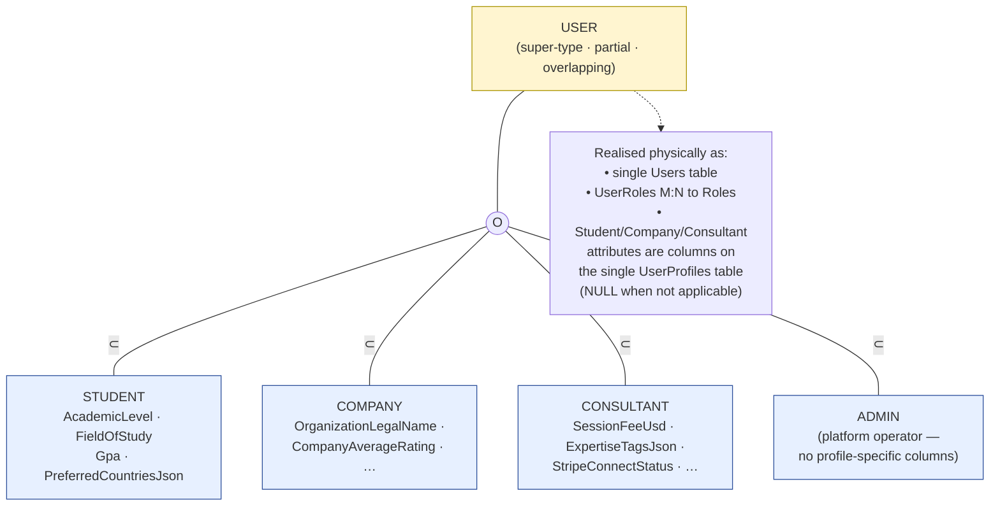

### 3.2 Identity, Access & Profile

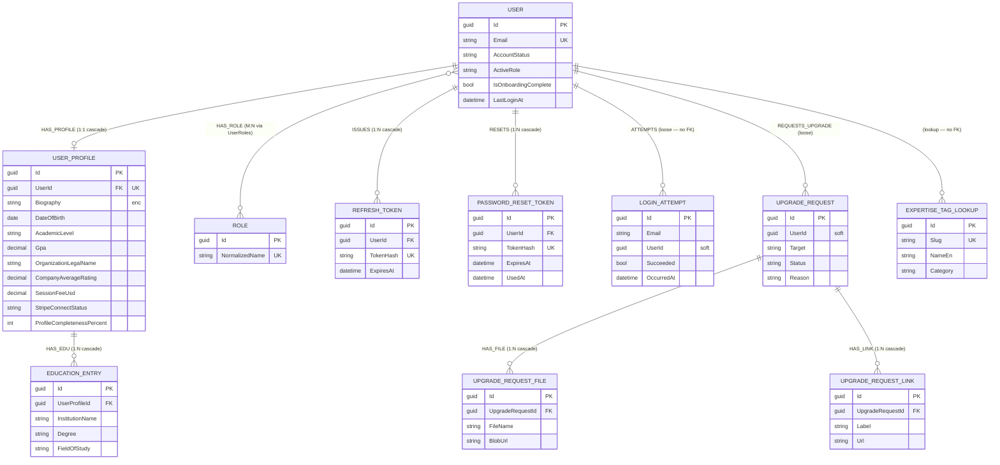

### 3.3 Scholarships, Applications & Documents

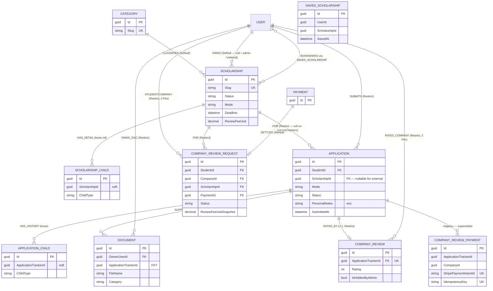

### 3.4 Consultant Booking, Payments & Ratings

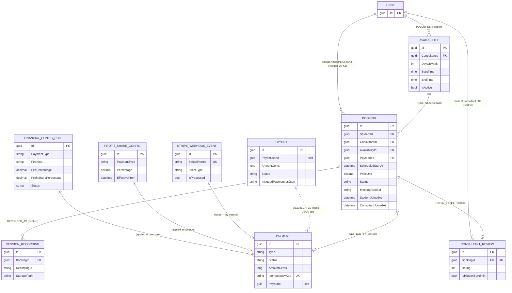

### 3.5 Community & Chat

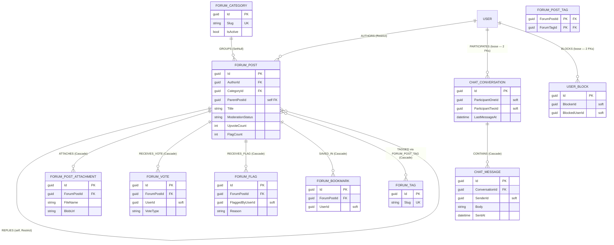

### 3.6 Resources Hub & Notifications

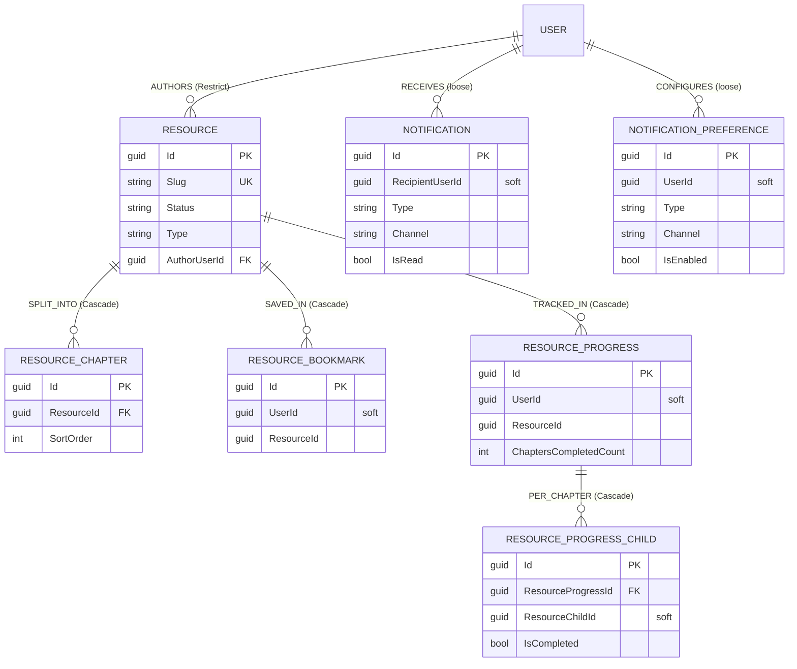

### 3.7 AI, Knowledge, Platform & Cross-cutting

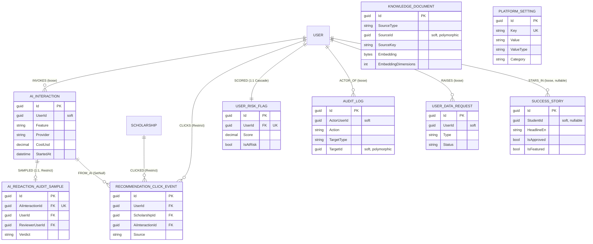

---

## Section 4 — Relational Mapping (corrected text + ER overview)

**Closes:** `R1` (`COMPANY_REVIEW_PAYMENTS` added), `R2` (`USERS` audit columns corrected), `R3` (`USER_PROFILES` expanded), `R4` (`BOOKINGS` extra fields), `R5` (`COMPANY_REVIEW_REQUEST` status enum complete), `R6` (`KNOWLEDGE_DOCUMENTS` derived flag noted), `R7` (low-rating filtered index added), `R8` (OCR artefacts removed).

### Notation (kept from the original)

- PK is the first attribute; all PKs are `Guid` (`uniqueidentifier`) unless noted.
- `*UK` = unique index; `*FUK` = filtered (partial) unique index; `(enc)` = AES-256-GCM encrypted at rest; `(cents)` = integer minor-currency unit.
- `(audit)` = `CreatedAt, CreatedByUserId, UpdatedAt, UpdatedByUserId, RowVersion`.
- `(audit-thin)` = `CreatedAt, UpdatedAt, RowVersion` only — used by `USERS` (it inherits `IdentityUser<Guid>`, not `AuditableEntity`).
- `(softdel)` = `IsDeleted, DeletedAt, DeletedByUserId`.
- `(soft)` next to a column = loose reference (no `FOREIGN KEY` constraint, integrity in app code).
- FK lines: `→ TABLE(Id) {Cascade|Restrict|SetNull}`.

### Identity, Access & Profile

```
USERS( Id, Email *UK, NormalizedEmail *UK, FirstName, LastName, PasswordHash,
       SecurityStamp, EmailConfirmed, PhoneNumber, LockoutEnd, LockoutEnabled,
       AccessFailedCount, ProfileImageUrl, AccountStatus, ActiveRole,
       IsOnboardingComplete, PreferredLanguage, CountryOfResidence, LastLoginAt,
       (audit-thin), (softdel) )
  -- USERS does NOT carry CreatedByUserId / UpdatedByUserId (ApplicationUser
  -- inherits IdentityUser<Guid>, not AuditableEntity).
  -- Standard Identity child tables: UserClaims, UserLogins, UserTokens, RoleClaims.

ROLES( Id, Name, NormalizedName *UK, Description, CreatedAt )

USER_ROLES( UserId, RoleId )                                -- M:N junction
  PK = (UserId, RoleId)
  FK UserId → USERS(Id) [Cascade]
  FK RoleId → ROLES(Id) [Cascade]

USER_PROFILES( Id, UserId *UK,
    -- common
    Biography (enc), BiographyAr, DateOfBirth, Nationality, Timezone,
    LinkedInUrl, WebsiteUrl, PortfolioUrl,
    -- student
    AcademicLevel, FieldOfStudy, CurrentInstitution,
    Gpa, GpaScale, PreferredCountriesJson, PreferredFieldsJson,
    -- company
    OrganizationLegalName, OrganizationRegistrationNumber, OrganizationWebsite,
    OrganizationVerificationStatus, OrganizationVerifiedAt,
    OrganizationEmail, OrganizationCountry, OrganizationTaxNumber,
    CompanyType, CompanyDescription,
    ContactPersonFullName, ContactPersonPosition, ContactPhoneNumber,
    CompanyAverageRating, CompanyReviewCount, CompanyLowRatingFlaggedAt,
    IsTaxRegistered, TaxNotApplicableReason,
    IsLegallyRegistered, LegalRegistrationNotApplicableReason,
    LastOnboardingRejectionReason, LastOnboardingRejectedAt,
    -- consultant
    SessionFeeUsd, SessionDurationMinutes,
    ExpertiseTagsJson, LanguagesJson, ConsultantVerifiedAt,
    ProfessionalTitle, HighestDegree, FieldOfExpertise,
    YearsOfExperience, BookingIntakeSuspendedAt,
    -- payouts
    StripeConnectAccountId, StripeConnectStatus, StripeConnectOnboardedAt,
    -- computed
    ProfileCompletenessPercent,
    (audit) )
  FK UserId → USERS(Id) [Cascade]                           -- 1:1
  *Filtered index* IX_UserProfiles_CompanyLowRatingFlagged
      WHERE [CompanyLowRatingFlaggedAt] IS NOT NULL

EDUCATION_ENTRIES( Id, UserProfileId, InstitutionName, Degree, FieldOfStudy,
                   StartDate, EndDate, Gpa, Description, (audit) )
  FK UserProfileId → USER_PROFILES(Id) [Cascade]

EXPERTISE_TAGS( Id, Slug *UK, NameEn, NameAr, Category )    -- lookup, no FK

REFRESH_TOKENS( Id, UserId, TokenHash *UK, ExpiresAt, IsRevoked, RevokedAt,
                RevokedReason, ReplacedByTokenId (soft), IpAddress, UserAgent,
                (audit) )
  FK UserId → USERS(Id) [Cascade]

PASSWORD_RESET_TOKENS( Id, UserId, TokenHash *UK, ExpiresAt, UsedAt, (audit) )
  FK UserId → USERS(Id) [Cascade]

LOGIN_ATTEMPTS( Id, Email, UserId (soft), Succeeded, FailureReason,
                OccurredAt, IpAddress, UserAgent )

UPGRADE_REQUESTS( Id, UserId (soft), Target, Status, Reason, ReviewerNotes,
                  ReviewedByAdminId (soft), ReviewedAt, (audit), (softdel) )

UPGRADE_REQUEST_FILES( Id, UpgradeRequestId, FileName, BlobUrl, SizeBytes,
                       ContentType, UploadedAt )
  FK UpgradeRequestId → UPGRADE_REQUESTS(Id) [Cascade]

UPGRADE_REQUEST_LINKS( Id, UpgradeRequestId, Label, Url )
  FK UpgradeRequestId → UPGRADE_REQUESTS(Id) [Cascade]
```

### Scholarships, Applications & Documents

```
CATEGORIES( Id, Slug *UK, NameEn, NameAr, DescriptionEn, DescriptionAr,
            IconKey, DisplayOrder, (audit) )

SCHOLARSHIPS( Id, CategoryId, OwnerCompanyId, CreatedByAdminId (soft),
              Slug *UK, TitleEn, TitleAr, DescriptionEn, DescriptionAr,
              Mode, ExternalApplicationUrl, Status, Deadline, OpenedAt,
              ArchivedAt, IsFeatured, FeaturedOrder, FundingType,
              FundingAmountUsd, Currency, TargetLevel, TargetCountriesJson,
              FieldsOfStudyJson, EligibilityRequirementsEn,
              EligibilityRequirementsAr, TagsJson,
              ApplicationFormSchemaJson, RequiredDocumentsJson,
              ReviewFeeUsd, (audit), (softdel) )
  FK CategoryId      → CATEGORIES(Id) [SetNull]
  FK OwnerCompanyId  → USERS(Id) [SetNull]                  -- null = admin / external

SCHOLARSHIP_CHILDREN( Id, ScholarshipId (soft), ChildType, KeyEn, KeyAr,
                      ValueEn, ValueAr, SortOrder )         -- EAV row; loose

SAVED_SCHOLARSHIPS( Id, UserId (soft), ScholarshipId (soft), SavedAt, Note )
  *UK (UserId, ScholarshipId)                               -- M:N bookmark

APPLICATIONS( Id, StudentId, ScholarshipId, Mode, Status,
              FormDataJson, AttachedDocumentsJson,
              ExternalTrackingUrl, ExternalReferenceId,
              ExternalTitle, ExternalProvider, Deadline,
              SubmittedAt, WithdrawnAt, ReviewStartedAt, DecisionAt,
              DecisionReason, NextReminderAt,
              PersonalNotes (enc), (audit), (softdel) )
  FK StudentId      → USERS(Id) [Restrict]
  FK ScholarshipId  → SCHOLARSHIPS(Id) [Restrict]            -- null = external tracker
  *FUK (StudentId, ScholarshipId)
      WHERE ScholarshipId IS NOT NULL
        AND Status NOT IN ('Withdrawn','Rejected','Accepted')   -- FR-057

APPLICATION_CHILDREN( Id, ApplicationTrackerId (soft), ChildType, Title,
                      Content, MetadataJson, OccurredAt,
                      ActorUserId (soft), SortOrder )

DOCUMENTS( Id, OwnerUserId, ApplicationTrackerId, FileName, ContentType,
           SizeBytes, StoragePath, Category, UploadedAt, (audit), (softdel) )
  FK OwnerUserId           → USERS(Id) [Restrict]
  FK ApplicationTrackerId  → APPLICATIONS(Id) [SetNull]

COMPANY_REVIEW_REQUESTS( Id, StudentId, CompanyId, ScholarshipId,
                         ApplicationTrackerId (soft), PaymentId,
                         Status, ReviewFeeUsdSnapshot, Currency,
                         SubmittedAt, AcceptedAt, RejectedAt, CompletedAt,
                         ClosedAt, CancelledAt, ExpiredAt, PendingExpiresAt,
                         CancelReason, RejectReason,
                         (audit), (softdel) )
  -- Status enum (11 values, full set):
  --   Draft, Submitted, Pending, UnderReview, Completed, Closed,
  --   Cancelled, Failed, CancelledByStudent, RejectedByCompany, Expired.
  FK StudentId      → USERS(Id) [Restrict]
  FK CompanyId      → USERS(Id) [Restrict]
  FK ScholarshipId  → SCHOLARSHIPS(Id) [Restrict]
  FK PaymentId      → PAYMENTS(Id) [SetNull]
  *FUK (StudentId, ScholarshipId)
      WHERE Status IN ('Draft','Submitted','Pending','UnderReview')

COMPANY_REVIEWS( Id, ApplicationTrackerId *UK, StudentId, CompanyId,
                 Rating, Comment, IsHiddenByAdmin, AdminNote,
                 (audit), (softdel) )                       -- 1:1 per application
  FK ApplicationTrackerId → APPLICATIONS(Id) [Restrict]
  FK StudentId            → USERS(Id) [Restrict]
  FK CompanyId            → USERS(Id) [Restrict]

-- ── legacy table (still in the schema, no new code paths use it) ──
COMPANY_REVIEW_PAYMENTS( Id, ApplicationTrackerId, CompanyId,
                         AmountUsd, ProfitShareAmountUsd, PayeeAmountUsd,
                         StripePaymentIntentId *UK, IdempotencyKey *UK,
                         Status, CapturedAt, RefundedAmountUsd, RefundReason,
                         (audit) )
  -- Functionally superseded by COMPANY_REVIEW_REQUESTS + PAYMENTS.
```

### Consultant Booking, Payments & Ratings

```
AVAILABILITIES( Id, ConsultantId, DayOfWeek, StartTime, EndTime,
                SpecificStartAt, SpecificEndAt, Timezone, IsRecurring,
                IsActive, (audit), (softdel) )
  FK ConsultantId → USERS(Id) [Restrict]

BOOKINGS( Id, StudentId, ConsultantId, AvailabilityId, PaymentId,
          ScheduledStartAt, ScheduledEndAt, DurationMinutes, PriceUsd,
          StudentNotes, MeetingRoomId,
          RecordingStartedAt, RecordingId,                  -- PB-006
          Status, RequestedAt, ConfirmedAt, RejectedAt, ExpiredAt,
          CancelledAt, CompletedAt,
          CancellationReason, CancelledByUserId (soft),
          StripePaymentIntentId,
          IsNoShowStudent, IsNoShowConsultant, NoShowMarkedAt,
          StudentJoinedAt, ConsultantJoinedAt,              -- FR-217 attendance
          (audit), (softdel) )
  FK StudentId      → USERS(Id) [Restrict]
  FK ConsultantId   → USERS(Id) [Restrict]
  FK AvailabilityId → AVAILABILITIES(Id) [SetNull]
  FK PaymentId      → PAYMENTS(Id) [SetNull]
  *FUK (ConsultantId, ScheduledStartAt)
      WHERE Status IN ('Requested','Confirmed')

PAYMENTS( Id, PayerUserId (soft), PayeeUserId (soft),
          RelatedBookingId (soft), RelatedApplicationId (soft),
          PayoutId (soft),
          Type, Status, AmountCents (cents), Currency,
          ProfitShareAmountCents (cents), PayeeAmountCents (cents),
          RefundedAmountCents (cents),
          StripePaymentIntentId, StripeChargeId,
          IdempotencyKey *UK,
          HeldAt, CapturedAt, RefundedAt, RefundReason, FailureReason,
          (audit), (softdel) )
  -- No database FKs by design (audit-decoupled).

PAYOUTS( Id, PayeeUserId (soft), AmountCents (cents), Currency,
         Status, StripePayoutId, StripeConnectAccountId,
         InitiatedAt, PaidAt, FailureReason,
         IncludedPaymentIdsJson, (audit) )

CONSULTANT_REVIEWS( Id, BookingId *UK, StudentId, ConsultantId,
                    Rating, Comment, IsHiddenByAdmin, AdminNote,
                    (audit), (softdel) )                    -- 1:1 per booking
  FK BookingId    → BOOKINGS(Id) [Restrict]
  FK StudentId    → USERS(Id) [Restrict]
  FK ConsultantId → USERS(Id) [Restrict]

SESSION_RECORDINGS( Id, BookingId, RecordingId, StoragePath, ContentType,
                    SizeBytes, RecordedAt, (audit), (softdel) )
  FK BookingId → BOOKINGS(Id) [Restrict]

STRIPE_WEBHOOK_EVENTS( Id, StripeEventId *UK, EventType, RawPayload,
                       ReceivedAt, ProcessedAt, IsProcessed,
                       ProcessingAttempts, ProcessingError )

PROFIT_SHARE_CONFIGS( Id, PaymentType, Percentage,
                      EffectiveFrom, EffectiveTo,
                      SetByAdminId (soft), Notes, (audit) )
  *FUK (PaymentType) WHERE EffectiveTo IS NULL              -- PB-014 AC#1

FINANCIAL_CONFIG_RULES( Id, PaymentType, FeeKind,
                        FeePercentage, FeeAmountCents,
                        ProfitSharePercentage,
                        Status, EffectiveFrom, EffectiveTo,
                        SetByAdminId (soft), Notes, (audit) )
  *FUK (PaymentType) WHERE Status = 'Active'                -- FR-170
```

### Community & Chat

```
FORUM_CATEGORIES( Id, Slug *UK, NameEn, NameAr, DescriptionEn,
                  DescriptionAr, DisplayOrder, IsActive, (audit) )

FORUM_POSTS( Id, AuthorId, CategoryId, ParentPostId,
             Title, BodyMarkdown, ModerationStatus,
             UpvoteCount, DownvoteCount, FlagCount, ReplyCount,
             IsAutoHidden, AutoHiddenAt,
             ModeratedByAdminId (soft), ModeratedAt, ModerationNote,
             (audit), (softdel) )
  FK AuthorId      → USERS(Id) [Restrict]
  FK CategoryId    → FORUM_CATEGORIES(Id) [SetNull]
  FK ParentPostId  → FORUM_POSTS(Id) [Restrict]             -- self; null = root

FORUM_POST_ATTACHMENTS( Id, ForumPostId, FileName, BlobUrl,
                        ContentType, SizeBytes )
  FK ForumPostId → FORUM_POSTS(Id) [Cascade]

FORUM_VOTES( Id, ForumPostId, UserId (soft), VoteType, VotedAt )
  FK ForumPostId → FORUM_POSTS(Id) [Cascade]
  *UK (ForumPostId, UserId)

FORUM_FLAGS( Id, ForumPostId, FlaggedByUserId (soft), Reason,
             AdditionalDetails, FlaggedAt, IsValid )
  FK ForumPostId → FORUM_POSTS(Id) [Cascade]
  *UK (ForumPostId, FlaggedByUserId)

FORUM_BOOKMARKS( Id, ForumPostId, UserId (soft), CreatedAt )
  FK ForumPostId → FORUM_POSTS(Id) [Cascade]
  *UK (ForumPostId, UserId)

FORUM_TAGS( Id, Name, Slug *UK, CreatedAt )

FORUM_POST_TAGS( ForumPostId, ForumTagId )                  -- M:N junction
  PK = (ForumPostId, ForumTagId)
  FK ForumPostId → FORUM_POSTS(Id) [Cascade]
  FK ForumTagId  → FORUM_TAGS(Id) [Cascade]

CONVERSATIONS( Id, ParticipantOneId (soft), ParticipantTwoId (soft),
               LastMessageAt, LastMessageId (soft),
               IsArchivedForParticipantOne, IsArchivedForParticipantTwo,
               (audit) )
  *UK (ParticipantOneId, ParticipantTwoId)                  -- one DM pair

MESSAGES( Id, ConversationId, SenderId (soft), Body, SentAt, ReadAt,
          (audit), (softdel) )
  FK ConversationId → CONVERSATIONS(Id) [Cascade]

USER_BLOCKS( Id, BlockerId (soft), BlockedUserId (soft), BlockedAt, Reason )
  *UK (BlockerId, BlockedUserId)
```

### Resources Hub & Notifications

```
RESOURCES( Id, AuthorUserId, Slug *UK, TitleEn, TitleAr,
           DescriptionEn, DescriptionAr,
           ContentMarkdownEn, ContentMarkdownAr,
           ExternalLinkUrl, CoverImageUrl,
           AuthorRole, Type, Status, CategorySlug, TagsJson,
           IsFeatured, FeaturedOrder, PublishedAt,
           ReviewedAt, ReviewedByAdminId (soft), RejectionReason,
           (audit), (softdel) )
  FK AuthorUserId → USERS(Id) [Restrict]                    -- via global cascade-sweep

RESOURCE_CHAPTERS( Id, ResourceId, TitleEn, TitleAr,
                   ContentMarkdownEn, ContentMarkdownAr,
                   SortOrder, EstimatedReadMinutes )
  FK ResourceId → RESOURCES(Id) [Cascade]

RESOURCE_BOOKMARKS( Id, ResourceId, UserId (soft), BookmarkedAt )
  FK ResourceId → RESOURCES(Id) [Cascade]
  *UK (UserId, ResourceId)

RESOURCE_PROGRESS( Id, ResourceId, UserId (soft),
                   ChaptersCompletedCount, LastAccessedAt, (audit) )
  FK ResourceId → RESOURCES(Id) [Cascade]
  *UK (UserId, ResourceId)

RESOURCE_PROGRESS_CHILDREN( Id, ResourceProgressId,
                            ResourceChildId (soft),
                            IsCompleted, CompletedAt )
  FK ResourceProgressId → RESOURCE_PROGRESS(Id) [Cascade]
  *UK (ResourceProgressId, ResourceChildId)

NOTIFICATIONS( Id, RecipientUserId (soft), Type, Channel,
               TitleEn, TitleAr, BodyEn, BodyAr,
               DeepLink, MetadataJson, IsRead, ReadAt, Priority,
               IdempotencyKey, DispatchedAt, DispatchSucceeded,
               DispatchError, (audit), (softdel) )

NOTIFICATION_PREFERENCES( Id, UserId (soft), Type, Channel, IsEnabled,
                          (audit) )
  *UK (UserId, Type, Channel)
```

### AI, Knowledge, Platform & Cross-cutting

```
AI_INTERACTIONS( Id, UserId (soft), Feature, Provider, ModelName,
                 SessionId, PromptText, ResponseText,
                 PromptTokens, CompletionTokens, CostUsd, MetadataJson,
                 StartedAt, CompletedAt, ErrorMessage, (audit) )

RECOMMENDATION_CLICK_EVENTS( Id, UserId, ScholarshipId, AiInteractionId,
                             ClickedAt, Source )
  FK UserId           → USERS(Id) [Restrict]
  FK ScholarshipId    → SCHOLARSHIPS(Id) [Restrict]
  FK AiInteractionId  → AI_INTERACTIONS(Id) [SetNull]

AI_REDACTION_AUDIT_SAMPLES( Id, AiInteractionId *UK, UserId, ReviewerUserId,
                            RedactedPrompt, SampledAt, Verdict, ReviewedAt )
  FK AiInteractionId → AI_INTERACTIONS(Id) [Restrict]
  FK UserId          → USERS(Id) [Restrict]
  FK ReviewerUserId  → USERS(Id) [Restrict]

KNOWLEDGE_DOCUMENTS( Id, SourceType,
                     SourceId (soft, polymorphic), SourceKey,
                     TitleEn, TitleAr, ContentEn, ContentAr, ContentHash,
                     Embedding, EmbeddingDimensions, EmbeddingModel,
                     IndexedAt, MetadataJson, (audit) )
  *UK (SourceType, SourceKey)
  -- IsEmbedded is a derived getter, EF-ignored (no column).

PLATFORM_SETTINGS( Id, Key *UK, Value, ValueType,
                   DescriptionEn, DescriptionAr, Category,
                   UpdatedByAdminId (soft), (audit) )

AUDIT_LOGS( Id, ActorUserId (soft), Action, TargetType,
            TargetId (soft, polymorphic),
            BeforeJson, AfterJson, IpAddress, UserAgent,
            OccurredAt, CorrelationId, Summary )

USER_DATA_REQUESTS( Id, UserId (soft), Type, Status,
                    RequestedAt, ScheduledProcessAt,
                    CompletedAt, CancelledAt,
                    DownloadUrl, DownloadExpiresAt, FailureReason, (audit) )

SUCCESS_STORIES( Id, StudentId (soft, nullable), AuthorDisplayName,
                 AuthorImageUrl, HeadlineEn, HeadlineAr, BodyEn, BodyAr,
                 ScholarshipNameEn, ScholarshipNameAr, CountryCode,
                 IsApproved, IsFeatured, FeaturedOrder, (audit), (softdel) )

USER_RISK_FLAGS( Id, UserId *UK, Score, IsAtRisk, Reason,
                 ComputedAt, SourceRefreshId (soft) )
  FK UserId → USERS(Id) [Cascade]                           -- 1:1
```

### Referential-integrity summary (unchanged)

| Delete rule | Used for | Why |
|---|---|---|
| `Cascade` | profile, education, tokens, upgrade files/links, forum attachments / votes / flags / bookmarks / post-tags, messages, resource chapters / bookmarks / progress, user-risk-flag | child has no meaning without its parent |
| `Restrict` | applications, documents, bookings, all reviews, recordings, recommendation clicks, redaction samples, every FK into USERS | protect history; avoid SQL Server multiple-cascade-paths (error 1785) |
| `SetNull` | scholarship→category/owner, document→application, booking→availability / payment, request→payment, post→category | keep the row, orphan the optional link |
| none (loose) | payments, payouts, notifications, votes / flags / bookmarks user, chat participants / sender, audit actor + target, AI userId, knowledge sourceId, settings / requests / stories user | decouple high-volume / audit / analytics rows so deletes & anonymisation never cascade-break |

### Entity count (corrected)

> **48 first-class domain entities + 7 Identity tables (`ApplicationUser`, `ApplicationRole`, plus 5 standard junction tables `IdentityUserClaim/Login/Token/RoleClaim/UserRole`) = 55 EF-managed entities (60 if you count all rows in the model snapshot).**

### Exporting the authoritative SQL (typos fixed)

```bash
cd server
dotnet ef migrations script \
  --project src/ScholarPath.Infrastructure \
  --startup-project src/ScholarPath.API \
  --output ../docs/diagrams/schema.sql
```

— end of redrawn diagrams —
