# ScholarPath — Enhanced Entity–Relationship Diagram (EERD)

> **Source of truth:** the live EF Core model snapshot
> `server/src/ScholarPath.Infrastructure/Migrations/ApplicationDbContextModelSnapshot.cs`
> (table names, keys, indexes) plus the domain entities under
> `server/src/ScholarPath.Domain/Entities/`. This document supersedes the older
> `docs/ERD-MAPPING.md`, which predates several merged modules.
>
> **Notation:** the *conceptual* model uses **Chen / Elmasri** notation (see the
> PlantUML `@startchen` sources in `plantuml/` for the textbook rectangles,
> diamonds and ellipses). The diagrams **inline below** are the same model in
> **Mermaid (crow's-foot)** so they render directly on GitHub and in the report.
> The legend maps one notation onto the other.

---

## 0. The EERD in authentic Chen / Elmasri notation (high-resolution)

The diagram below is the **conceptual EERD in textbook Chen notation** —
rectangles = entity types, diamonds = relationship types, ellipses =
attributes, underlined = key attributes, `1 / N` = cardinality ratios — rendered
from [`plantuml/eerd-chen-core.puml`](plantuml/eerd-chen-core.puml) as **vector
SVG** (open it and zoom in losslessly — no pixelation).

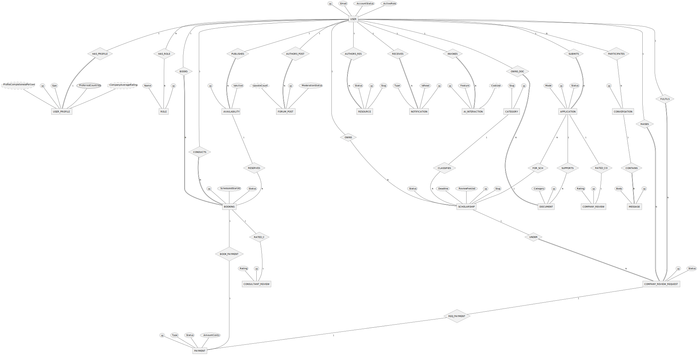

> The per-cluster diagrams in §4–§9 are a **crow's-foot detail companion** that
> list every entity + key attributes; the Chen diagram above is the conceptual
> master in the exact notation used by Elmasri & Navathe. All images here are
> now vector **SVG** (sharp at any zoom).

---

## 1. Notation legend (Elmasri ↔ crow's-foot)

| Concept (Elmasri / Chen) | Chen symbol | Crow's-foot (Mermaid) used here |
|---|---|---|
| Entity type | rectangle | named box `USERS { … }` |
| Weak entity type | double rectangle | box whose identity depends on a parent (noted *(weak)*) |
| Relationship type | diamond | the line between two boxes (verb label) |
| Attribute / key | ellipse / underlined ellipse | `PK`, `FK`, `UK` markers inside the box |
| Cardinality ratio 1:1 / 1:N / M:N | `1`, `N`, `M` on the edges | `||`, `o{`, `}o` crow's-foot ends |
| **Total** participation (mandatory) | **double line** | mandatory end `||` (one) / `}|` (one-or-many) |
| **Partial** participation (optional) | single line | optional end `|o` (zero-or-one) / `o{` (zero-or-many) |
| Specialization / generalization (ISA) | circle + subclass lines (EER) | shown separately in §3 (Mermaid can't draw the EER specialization **circle** with the d/o + total/partial markers — the authentic version is `img/eer-specialization.svg`) |

**One extra convention specific to this codebase — and it is important:**

| Line style | Meaning |
|---|---|
| **Solid** line (`--`) | a **database-enforced foreign key** (real `FOREIGN KEY` constraint with a declared delete rule). |
| **Dashed** line (`..`) | an **application-enforced "loose" reference** — a `Guid` column that *semantically* points at another row but has **no FK constraint** in the schema. Referential integrity is guaranteed by application code, not the database. |

The platform deliberately uses loose references for high-volume / audit / log /
analytics tables (notifications, votes, chat, audit log, AI interactions, …) so
that deleting or anonymising a user never cascade-breaks history. Modelling them
honestly is part of an accurate EERD.

> **Note for examiners:** in *standard* crow's-foot, a solid line is an
> *identifying* relationship and a dashed line a *non-identifying* one. Here we
> deliberately **repurpose** that visual distinction to mean **DB-enforced FK
> (solid)** vs **application-enforced loose reference (dashed)** — a project-
> specific convention, stated up front so the diagrams can't be misread.

---

## 2. Subject-area context (the big picture)

Everything radiates from **USERS** (the single ASP.NET Identity principal that
represents Students, Companies, Consultants and Admins — see §3). Each box below
is a subject area detailed in its own ER diagram (§4–§9).

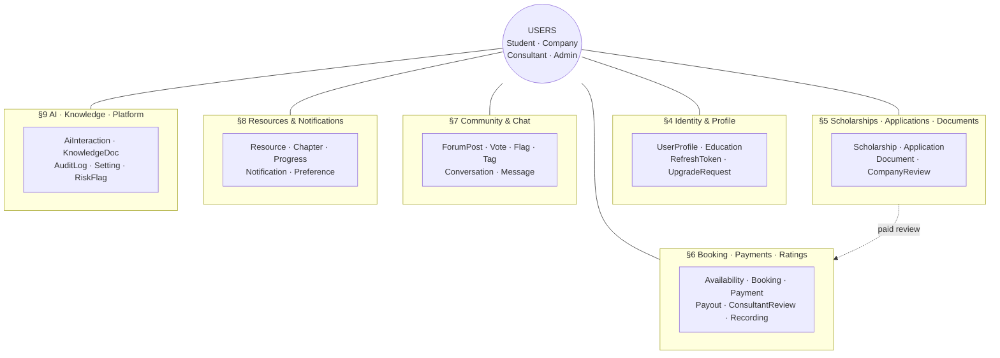

---

## 3. EER specialization — the USER super-type


This is the **"Enhanced"** part of the EERD. Conceptually, a **USER** is a
super-type specialized into four sub-types by the role(s) granted to it:

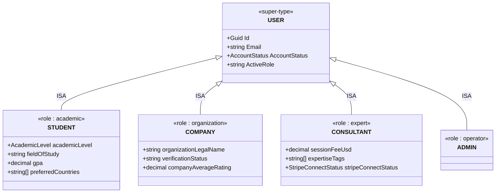

**Specialization constraints (EER):**

- **Overlapping `{o}`** — a user may hold **more than one** role at a time
  (dual-role: a Student can be upgraded to Consultant and keep both). This is why
  it is *not* a disjoint specialization.
- **Partial** — a freshly-registered user is `Unassigned` and belongs to **no**
  sub-type until role selection / onboarding completes.

**How this maps to the physical schema (code reality):**

- There is **no table-per-subclass**. The super-type is the `Users` table; role
  membership is the **`UserRoles`** join (ASP.NET Identity many-to-many to
  `Roles`). The seeded roles are exactly `Admin, Student, Company, Consultant,
  Unassigned`.
- The role-specific attributes (Student academic fields, Company organization
  fields, Consultant expert fields) are **all columns on the single
  `UserProfiles` table** — a *single-table* realization of the specialization,
  with the columns of the inapplicable sub-types left `NULL`.

So §3 is the conceptual EER view; §4 shows its physical realization.

---

## 4. Identity, Access & Profile

**Chen / Elmasri notation** (authentic book symbols):

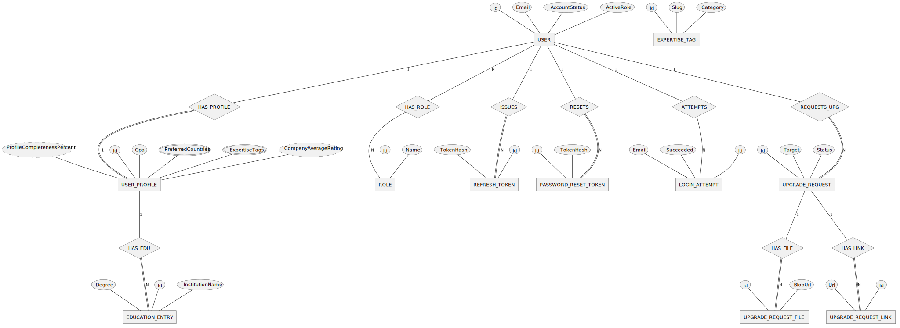

**Crow's-foot detail companion** (every entity + key attributes):


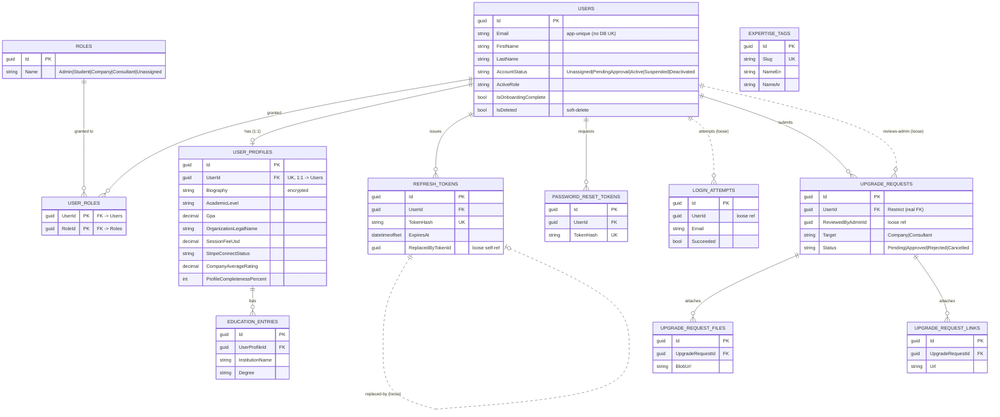

> `EXPERTISE_TAGS` is a standalone taxonomy table; consultant profiles reference
> it only through the denormalized `UserProfiles.ExpertiseTagsJson` string, so
> there is **no** relationship edge to it.

> **First-time onboarding vs. role upgrade (verified against code).**
> First-time **Company / Consultant onboarding** (SRS FR-ONB-03..07) is **not**
> modelled by `UPGRADE_REQUESTS`. It is realized by the *role-selection* flow:
> the onboarding payload is written onto `USER_PROFILES`, the principal's
> `USERS.AccountStatus` moves to `PendingApproval`, the admin queue reads
> `USERS WHERE AccountStatus = PendingApproval`, and the verification files are
> stored as `DOCUMENTS` with `Category = OnboardingDocument`. `UPGRADE_REQUESTS`
> (+ its `*_FILES` / `*_LINKS` children) backs **only the post-onboarding
> Student→Consultant role upgrade**; the `Target = Company` value and the file/
> link child tables exist in the schema/seed but are **not exercised by any live
> handler** (vestigial).

---

## 5. Scholarships, Applications & Documents

**Chen / Elmasri notation** (authentic book symbols):

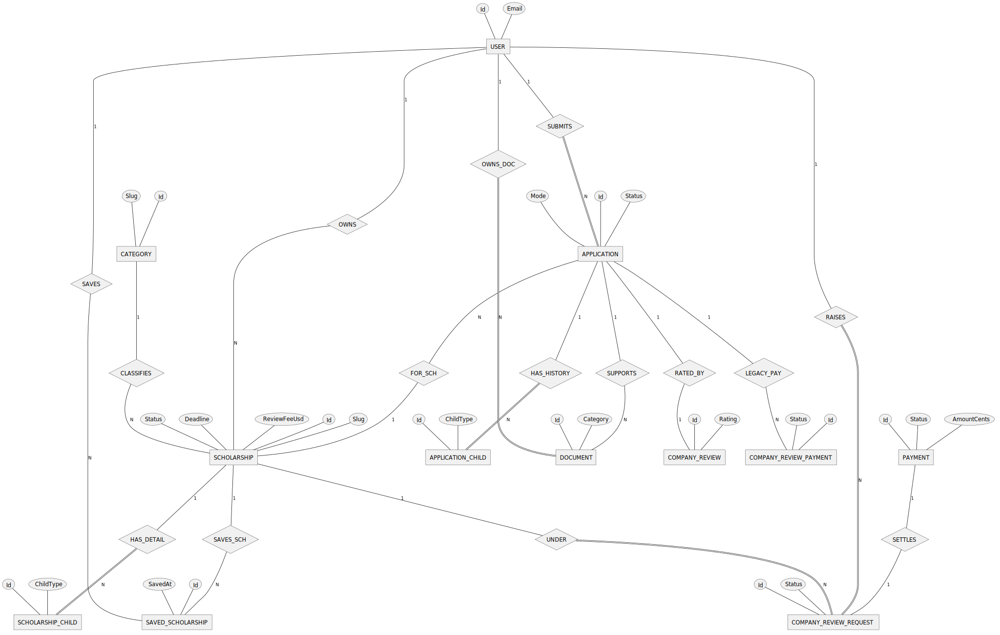

**Crow's-foot detail companion** (every entity + key attributes):


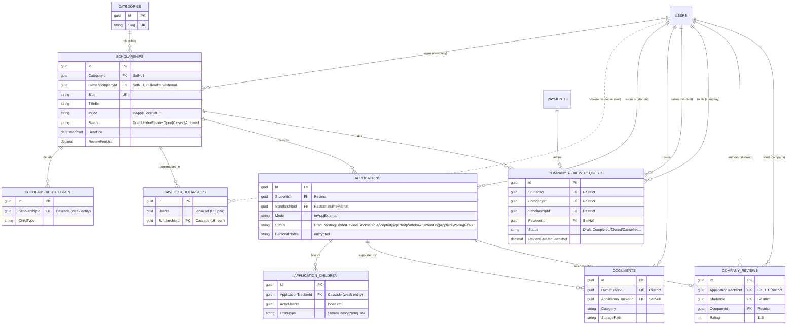

> **Single-active rule (FR-057 / FR-APP-03)** for in-app applications is
> enforced **in application code only** — there is **no** DB filtered-unique
> index on `Applications` in production (the old
> `UX_Applications_Student_Scholarship_Active` was dropped when `ScholarshipId`
> became nullable and was never recreated; live `Applications` carries only the
> non-unique `IX_Applications_ScholarshipId` and `IX_Applications_Status`).
> By contrast, the analogous **filtered-unique index on
> `CompanyReviewRequests(StudentId, ScholarshipId)` DOES exist** and DB-enforces
> one live paid-review request at a time.

---

## 6. Consultant Booking, Payments, Ratings & Recording

**Chen / Elmasri notation** (authentic book symbols):

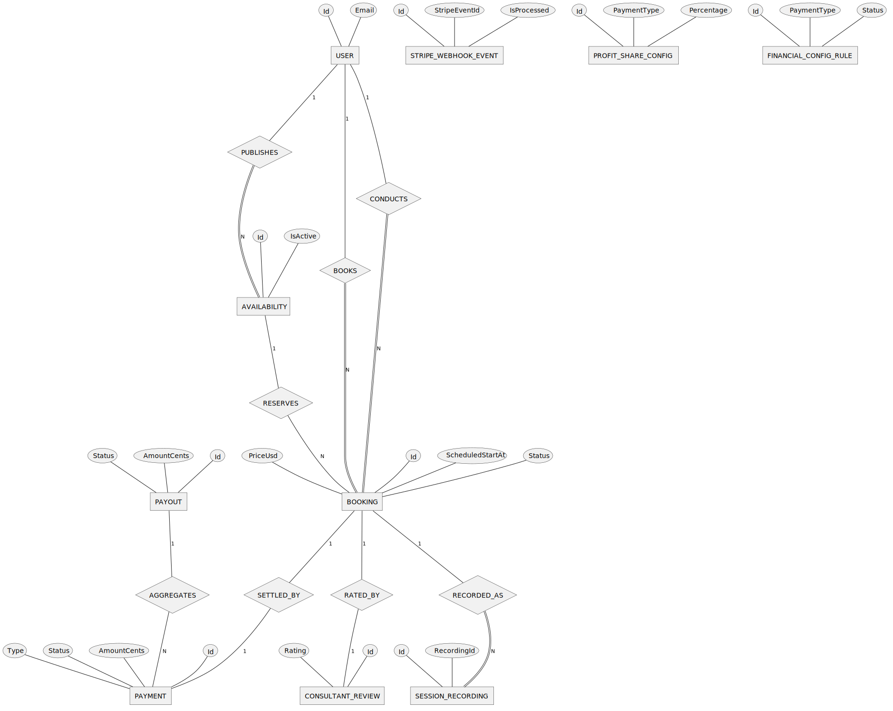

**Crow's-foot detail companion** (every entity + key attributes):


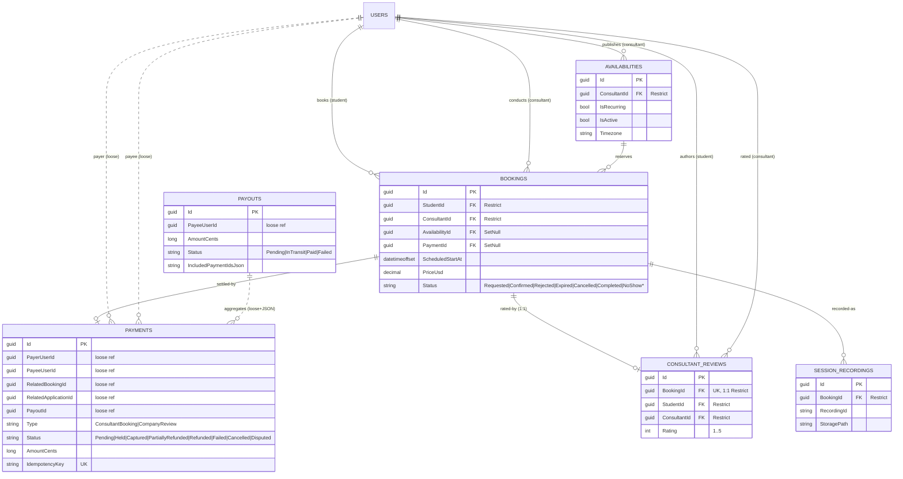

> **Money:** *settlement* amounts (`Payment`, `Payout`) are stored as `long`
> **cents** to avoid floating-point rounding; *catalogue / price* amounts
> (`Booking.PriceUsd`, `Scholarship.FundingAmountUsd` / `ReviewFeeUsd`,
> `UserProfile.SessionFeeUsd`) are `decimal(p,2)` dollars. **`Payment` and `Payout` have zero DB-enforced FKs** —
> every edge they touch (payer, payee, related booking/application, payout) is a
> loose reference, so they are decoupled from the principals for audit retention.
> Settlement / config tables `STRIPE_WEBHOOK_EVENTS`, `PROFIT_SHARE_CONFIGS`,
> `FINANCIAL_CONFIG_RULES`, `COMPANY_REVIEW_PAYMENTS` are standalone (admin/Stripe
> driven) and omitted here for legibility — see the relational mapping.

---

## 7. Community & Chat

**Chen / Elmasri notation** (authentic book symbols):

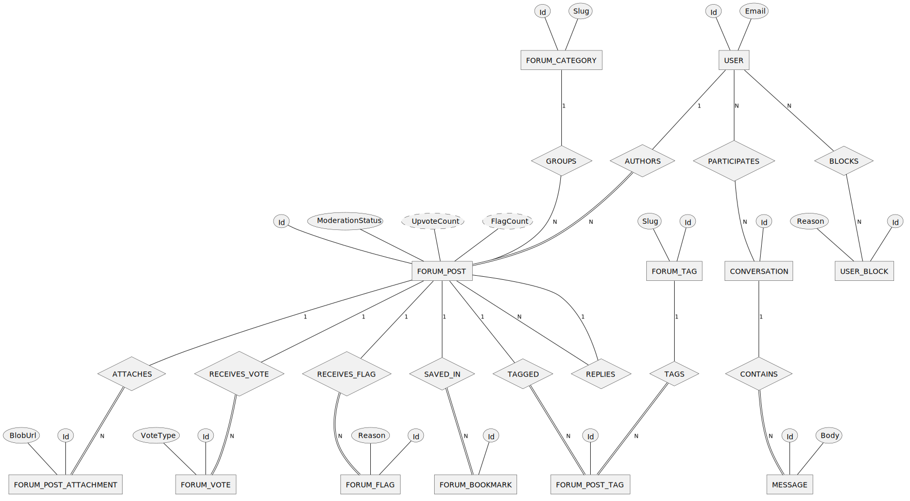

**Crow's-foot detail companion** (every entity + key attributes):


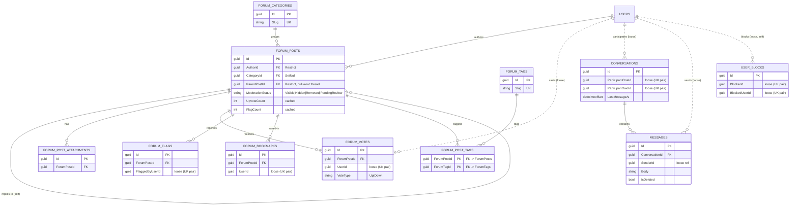

> `FORUM_POST_TAGS` is a **pure M:N junction** (composite PK = the two FKs) — a
> textbook many-to-many between posts and tags. Votes / flags / bookmarks each
> carry a **composite unique key** `(PostId, UserId)` enforcing *one per user per
> post*. `CONVERSATIONS` has a unique `(ParticipantOne, ParticipantTwo)` pair —
> one 1:1 DM channel per pair. **`FORUM_POST_ATTACHMENTS` is schema-only /
> planned** (verified): no upload or read path is wired yet — posts are
> markdown-only today.

---

## 8. Resources Hub & Notifications

**Chen / Elmasri notation** (authentic book symbols):

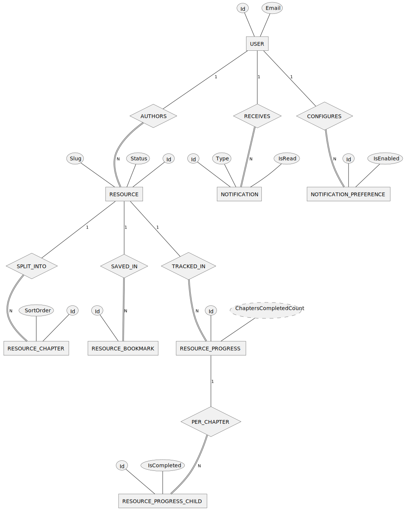

**Crow's-foot detail companion** (every entity + key attributes):


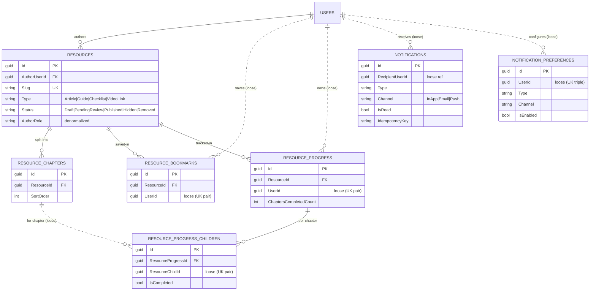

---

## 9. AI, Knowledge Base, Platform & Cross-cutting

**Chen / Elmasri notation** (authentic book symbols):

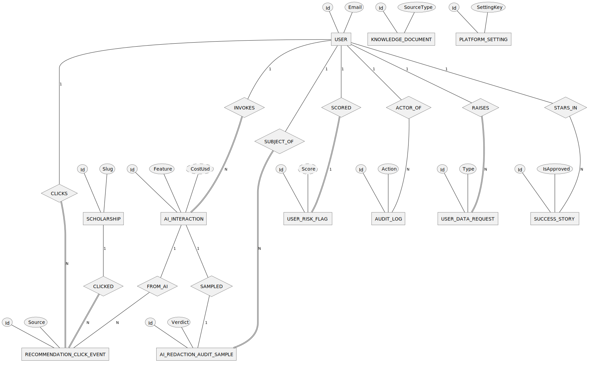

**Crow's-foot detail companion** (every entity + key attributes):


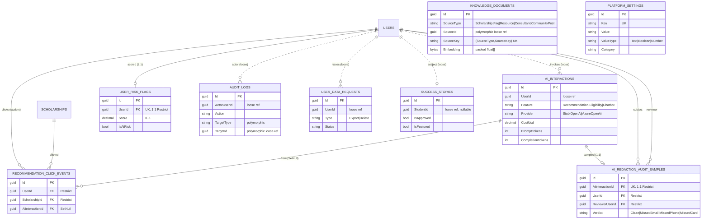

> `KNOWLEDGE_DOCUMENTS.SourceId` and `AUDIT_LOGS.(TargetType, TargetId)` are
> **polymorphic** references — they point at *any* entity type by id, so they
> cannot be a single FK. The vector `Embedding` is stored in-row as packed
> `varbinary`; cosine ranking runs in-process (a few hundred rows), so there is
> no separate vector-DB entity.

> **Cross-cutting entity status (verified against code).** `AI_INTERACTIONS`,
> `RECOMMENDATION_CLICK_EVENTS`, `AI_REDACTION_AUDIT_SAMPLES`, `USER_DATA_REQUESTS`
> (GDPR export/delete) and `AUDIT_LOGS` are **active** features (NFR / analytics-
> driven, not in a single SRS FR). `USER_RISK_FLAGS` is **active but read-only**
> from the API — rows are written out-of-band by the Power BI churn dataflow.
> **`SUCCESS_STORIES` is schema-only / planned** — seed data exists but there is
> no read/write code yet (homepage feature not built).

---

## 10. Cross-area relationships at a glance

| From | To | Ratio | Participation | Enforcement |
|---|---|---|---|---|
| User | UserProfile | 1 : 0..1 | profile total, user partial | **FK** Restrict |
| User ⋈ Role | (UserRoles) | M : N | — | **FK** (Identity); UserId Restrict, RoleId Cascade |
| Scholarship | Application | 1 : N | app side optional (external apps have no scholarship) | **FK** Restrict |
| Student (User) | Application | 1 : N | app total | **FK** Restrict |
| User (Student) ⋈ Scholarship | (SavedScholarships) | M : N | — | **loose** (unique index only) |
| Booking | Payment | 1 : 0..1 | both partial | **FK** SetNull |
| Booking | ConsultantReview | 1 : 0..1 | review total | **FK** Restrict, unique |
| Application | CompanyReview | 1 : 0..1 | review total | **FK** Restrict, unique |
| ForumPost ⋈ ForumTag | (ForumPostTag) | M : N | — | **FK** Cascade (both legs) |
| ForumPost | ForumPost (reply) | 1 : N | child partial (root has none) | **FK** Restrict (self) |
| User | Notification | 1 : N | — | **loose** |
| User | AuditLog (actor) | 1 : N | — | **loose** |
| AiInteraction | AiRedactionAuditSample | 1 : 0..1 | sample total | **FK** Restrict, unique |
| User | UserRiskFlag | 1 : 0..1 | flag total | **FK** Restrict, unique |

See **`02-RELATIONAL-MAPPING.md`** for the full table-by-table schema and
**`plantuml/`** for the Chen-notation (`@startchen`) sources.
