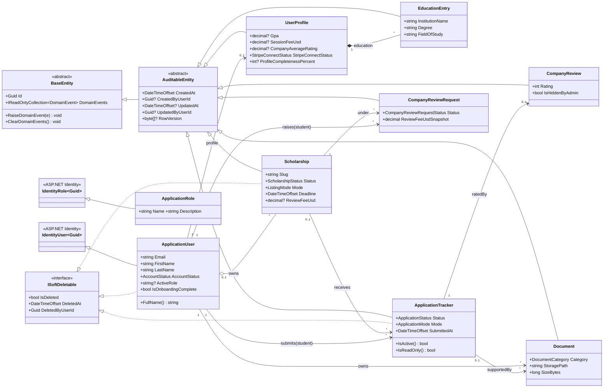
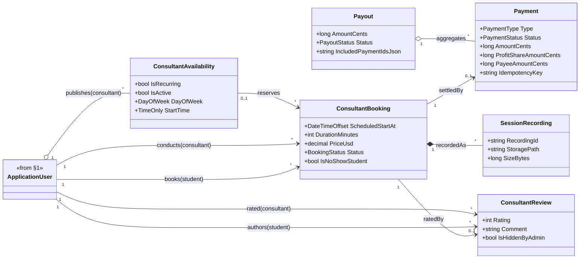
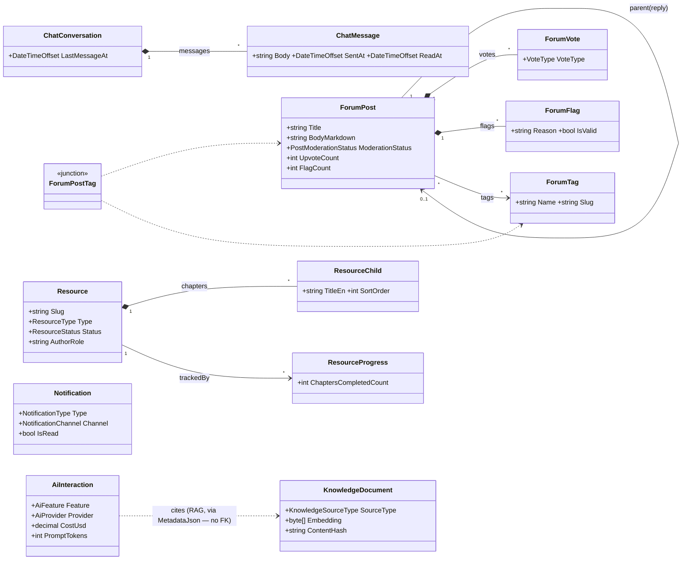
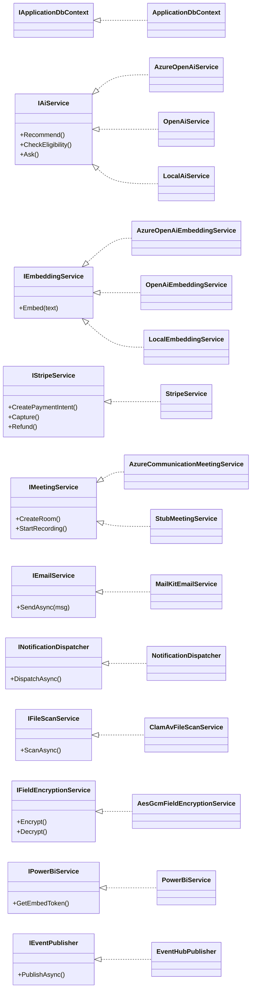

# ScholarPath — Class Diagrams (UML / Sommerville)

> UML class diagrams in the style of *Sommerville, Software Engineering (9th ed.)*:
> classes (name / attributes / operations), **generalization** (hollow triangle
> `<|--`), **realization** of interfaces (`<|..`), **composition** (filled
> diamond `*--`), **aggregation** (hollow diamond `o--`), plain **association**
> with role names and multiplicities. Diagrams below are Mermaid `classDiagram`
> (render on GitHub); the embedded PNGs are pre-rendered; PlantUML equivalents
> are in `plantuml/`.
>
> Grounded in `server/src/ScholarPath.Domain/Entities/*` and the application
> interfaces in `server/src/ScholarPath.Application/Common/Interfaces/*` with
> their Infrastructure implementations.

## Legend

| UML element | Mermaid | Meaning |
|---|---|---|
| Generalization | `Base <|-- Derived` | inheritance (`AuditableEntity` ← entities) |
| Realization | `Interface <|.. Class` | a class implements an interface |
| Composition | `Whole *-- Part` | part cannot exist without the whole |
| Aggregation | `Whole o-- Part` | part can exist independently |
| Association | `A "1" --> "*" B : role` | reference with multiplicity |
| `<<abstract>>` / `<<interface>>` | stereotype | abstract base / port |

---

> **Authentic UML class diagrams (PlantUML, vector SVG — sharp at any zoom):**
> [domain model](img/ScholarPath_Domain_Model.svg) ·
> [ports & adapters](img/ScholarPath_Ports_Adapters.svg) — source
> [`plantuml/class-diagrams.puml`](plantuml/class-diagrams.puml). The Mermaid
> views below are equivalent UML and are now embedded as vector SVG too.

## 1. Domain foundation + Identity, Profile, Scholarships & Applications

> **`ApplicationUser` / `ApplicationRole`** extend ASP.NET Identity's
> `IdentityUser<Guid>` / `IdentityRole<Guid>` — **not** `BaseEntity`/`AuditableEntity`.
> Because `ApplicationUser` cannot inherit `BaseEntity`, it re-implements the
> domain-event plumbing manually. **`ISoftDeletable` is realized by far more
> entities than the three shown** (also `Document`, `CompanyReview(Request)`,
> `ConsultantReview`, `ConsultantAvailability`, `ConsultantBooking`, `Payment`,
> `ChatMessage`, `ForumPost`, `Resource`, `Notification`, `SessionRecording`,
> `SuccessStory`); only a representative subset is drawn to keep the diagram legible.

---

## 2. Consultant Booking, Payments, Ratings & Recording

> `Payment`/`Payout` associations are drawn as UML associations but are
> **application-enforced** (no DB FK) — see the relational mapping. `Booking *--
> SessionRecording` is composition (a recording has no life outside its booking).

---

## 3. Community, Chat, Resources, Notifications & AI

---

## 4. Application architecture — ports & adapters (Clean Architecture)

The Application layer defines **ports** (interfaces); the Infrastructure layer
provides **adapters** (implementations), selected at start-up by DI / config
(`Ai__Provider`, environment). This is why the platform can swap a dev stub for
Azure OpenAI without touching application code.

> **Production adapters** (from config): `AzureOpenAiService` +
> `AzureOpenAiEmbeddingService` (`Ai__Provider=AzureOpenAi`),
> `StripeService`, `AzureCommunicationMeetingService` (video),
> `MailKitEmailService` (SMTP), `NotificationDispatcher` (writes
> `Notifications` + e-mail + SignalR), `ClamAvFileScanService`,
> `AesGcmFieldEncryptionService` (with a Key Vault key provider),
> `PowerBiService` + `EventHubPublisher` (analytics). **Every port has a
> config-selected dev fall-back** — `LocalAiService`, `LocalEmbeddingService`,
> `StubMeetingService`, `StubEmailService`, `StubStripeService`,
> `NoOpFileScanService`, `StubPowerBiService`, `StubEventPublisher` — but only the
> AI / embedding / meeting stubs are drawn above to keep the diagram legible.
> A third AI provider, `OpenAiService` + `OpenAiEmbeddingService`, is selected by
> `Ai__Provider=OpenAi` (OpenAI-direct, not Azure).
