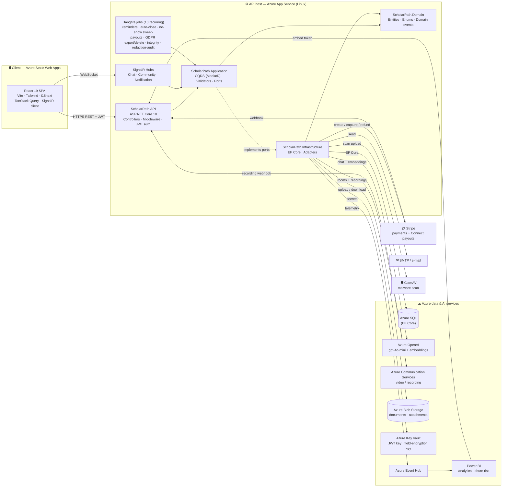
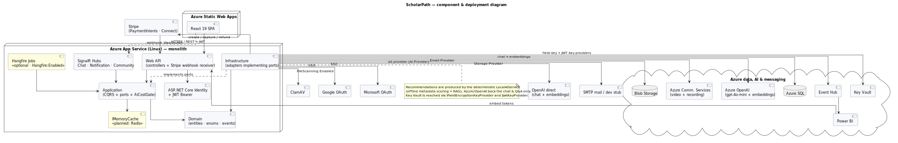

# ScholarPath — Component & Deployment Diagram (UML / Sommerville)

> UML **component diagram** in the style of *Sommerville, Software Engineering
> (9th ed.)*: components with **provided** and **required** interfaces, wired by
> dependencies, plus the external systems they integrate with. The Mermaid view
> below renders on GitHub (PNG embedded); the textbook lollipop/socket version
> is in `plantuml/component-diagram.puml`.
>
> Grounded in the solution structure (`ScholarPath.API / .Application / .Domain
> / .Infrastructure`), the Infrastructure adapters, and the deployed Azure
> topology.

## Architecture at a glance

ScholarPath is a **Clean Architecture** monolith: dependencies point inward
(`API → Application → Domain`; `Infrastructure → Application/Domain`). The
**Application** layer declares *ports* (interfaces); the **Infrastructure**
layer provides *adapters* that integrate the external services. The React SPA
is a separate deployable that talks to the API over REST (JWT) and WebSocket
(SignalR).

> **Power BI is read-only here.** The API only issues embed tokens via
> `IPowerBiService`; there is **no** reverse-ETL writing `UserRiskFlags` back to
> SQL in this codebase — that score is computed/written out-of-band (or left for
> future work), so it is intentionally **not** drawn as a live API data-flow.

> **Authentic UML component diagram (PlantUML, lollipop/socket interfaces,
> vector SVG):** 
> — source [`plantuml/component-diagram.puml`](plantuml/component-diagram.puml).

## Component responsibilities

| Component | Provided interface (what it offers) | Requires (depends on) |
|---|---|---|
| **React SPA** | the user-facing web app | API (REST), SignalR hubs |
| **ScholarPath.API** | HTTP/REST endpoints, JWT auth, Stripe webhook receiver | Application (MediatR) |
| **SignalR Hubs** | realtime push (chat, notifications, community) | Application |
| **Hangfire jobs** | 13 recurring jobs: booking reminders/completion, scholarship auto-close, meeting no-show sweep, session-expiry, Stripe payouts, GDPR data export/delete sweeps, integrity-check, deadline/draft reminders, company-review-timeout refund, redaction-audit sampling | Application |
| **SignalR realtime notifiers** | push chat/community/notification events to the hubs (`ChatRealtimeNotifier`, `CommunityRealtimeNotifier`, `PresenceTracker`) | Application |
| **ScholarPath.Application** | use-cases (commands/queries), **ports** (`IAiService`, `IStripeService`, `IMeetingService`, `IEmailService`, `IEmbeddingService`, `IApplicationDbContext`, …) | Domain |
| **ScholarPath.Domain** | entities, enums, domain events — the enterprise model | *nothing* (innermost) |
| **ScholarPath.Infrastructure** | **adapters** implementing every port | Application, Domain, all external services |

## External integrations (adapters → systems)

| Port (Application) | Adapter (Infrastructure) | External system |
|---|---|---|
| `IApplicationDbContext` | `ApplicationDbContext` (EF Core) | **Azure SQL** |
| `IAiService` | `AzureOpenAiService` | **Azure OpenAI** (gpt-4o-mini) |
| `IEmbeddingService` | `AzureOpenAiEmbeddingService` | **Azure OpenAI** (text-embedding-3-small) |
| `IStripeService` | `StripeService` | **Stripe** (PaymentIntents, Connect, webhooks) |
| `IMeetingService` | `AzureCommunicationMeetingService` | **Azure Communication Services** (video + recording) |
| `IEmailService` | `MailKitEmailService` | **SMTP** mail server |
| `IBlobStorageService` | `FileStorageService` | **Azure Blob Storage** |
| `IFileScanService` | `ClamAvFileScanService` | **ClamAV** daemon |
| `IFieldEncryptionService` | `AesGcmFieldEncryptionService` + Key Vault key provider | **Azure Key Vault** |
| JWT signing | `KeyVaultJwtKeyProvider` | **Azure Key Vault** |
| `IEventPublisher` | `EventHubPublisher` | **Azure Event Hub** → **Power BI** |
| `IPowerBiService` | `PowerBiService` | **Power BI** (embed tokens only — no reverse-ETL in this codebase) |
| `INotificationDispatcher` | `NotificationDispatcher` | writes `Notifications` + e-mail + SignalR |
| `IChatRealtimeNotifier` / `ICommunityRealtimeNotifier` | `ChatRealtimeNotifier` / `CommunityRealtimeNotifier` (+ `PresenceTracker`) | **SignalR** push to Chat / Community hubs |

> Each port has a **production adapter** (above) and a dev-time `Local*`/`Stub*`
> fall-back, selected by configuration (`Ai__Provider`, environment). This is the
> seam that lets the platform run fully offline in development yet hit real Azure
> services in production.
