# ScholarPath — Class Diagrams, EERD & Relational Mapping

Editable, regenerated diagram sources for the SRS design section, matching the
original SRS style:

- **Class diagrams** — PlantUML (`class/*.puml`)
- **EERD** — Graphviz, Chen notation (`eerd/*.dot`)
- **Relational mapping** — PlantUML, crow's-foot (`mapping/*.puml`)

Rendered PNGs live in [`images/`](images/). Regenerate everything with:

```bash
cd docs/diagrams && ./render.sh        # needs graphviz + plantuml
```

The authoritative schema is the EF model snapshot at
`server/src/ScholarPath.Infrastructure/Migrations/ApplicationDbContextModelSnapshot.cs`;
these diagrams were reconciled against it.

---

## Review fixes applied

These diagrams correct the inconsistencies found while reviewing the SRS
(`ScholarPath_SRS_compressed.docx`). Each fix is annotated in-diagram with a
`FIX (review)` note.

| # | Fix | Where |
|---|-----|-------|
| 1 | **Application → Document is 1:N** (was `0..1` in the SRS class diagram; `Documents.ApplicationTrackerId` is a nullable FK and the EERD `SUPPORTS` is N). | `class/03`, `eerd/04`, `mapping/02` |
| 2 | **ExpertiseTag related, not duplicated** — was a floating lookup *and* a multivalued attribute; now a single M:N relationship. | `class/02`, `eerd/03` |
| 3 | **Multivalued attributes mapped to tables** — `UserProfileExpertiseTags`, `UserPreferredCountries` (SRS mapping had none). Note: implementation denormalizes to JSON columns. | `mapping/01` |
| 4 | **Payment polymorphism explicit** — `Payment` settles either a `ConsultantBooking` (`RelatedBookingId`) or a `CompanyReviewRequest` (`RelatedApplicationId`); carries Payer/Payee. SRS only linked it to bookings. | `class/04`, `eerd/05`, `mapping/02`, `mapping/03` |
| 5 | **`CompanyReviewPayment` marked legacy/deprecated**, with the active path pointed to `Payment`. | `class/03`, `eerd/04` |
| 6 | **`UserBlock` has two user FKs** (`BlockerId`, `BlockedUserId`) — the SRS EERD implied a single user link. | `class/05`, `eerd/06`, `mapping/04` |
| 7 | **User participations made explicit in EERD** — who casts a vote / files a flag / saves a bookmark / sends a message / owns a progress record. | `eerd/06`, `eerd/07` |
| 8 | **Derived attributes marked** — `ChaptersCompletedCount` (and `ProfileCompletenessPercent`, `CompanyAverageRating`) shown derived consistently across class & EERD. | `class/06`, `eerd/03`, `eerd/07` |
| 9 | **Single-table inheritance strategy documented** — the EER specialization (Student/Company/Consultant/Admin) maps to `Users` + a single `UserProfiles` table. | `eerd/02`, `mapping/01` |

---

## Class Diagrams

### Figure 132 — Base Types & Shared Enumerations
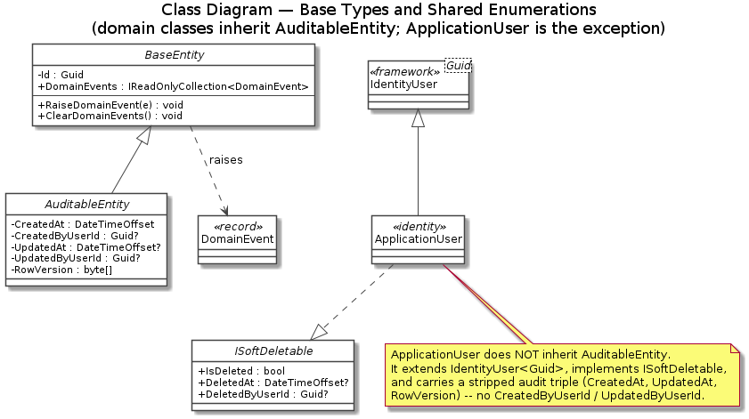

### Figure 133 — Identity & Profile
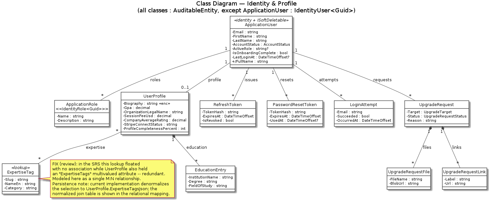

### Figure 134 — Scholarships, Applications & Documents
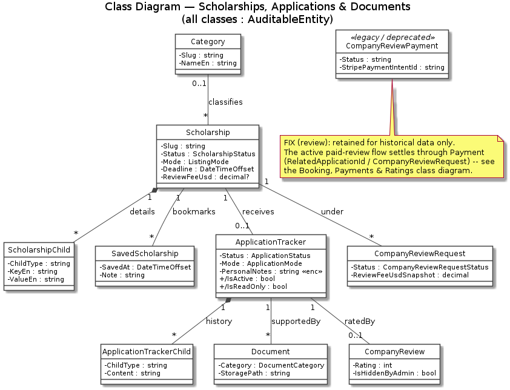

### Figure 135 — Consultant Booking, Payments & Ratings
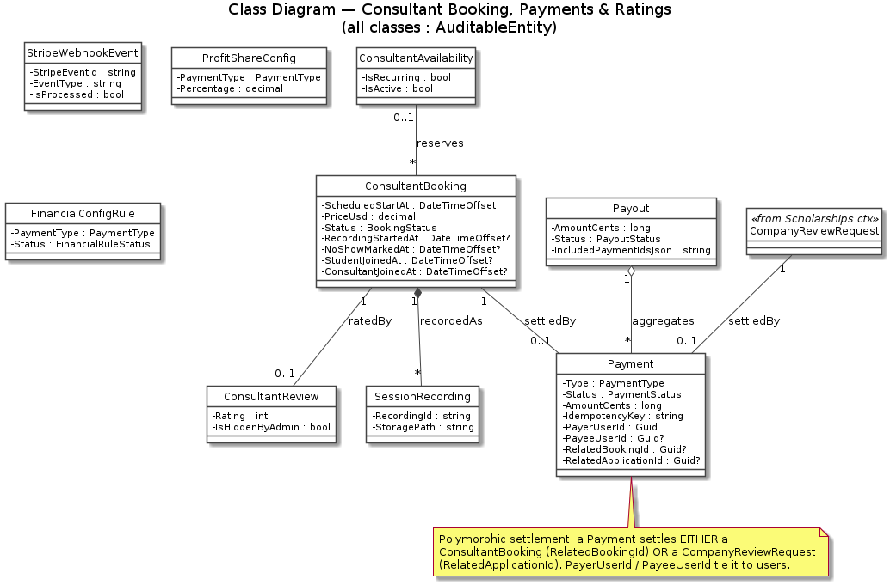

### Figure 136 — Community & Chat
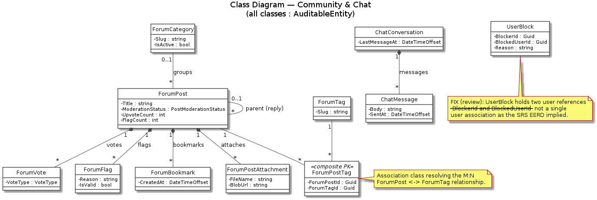

### Figure 137 — Resources Hub & Notifications
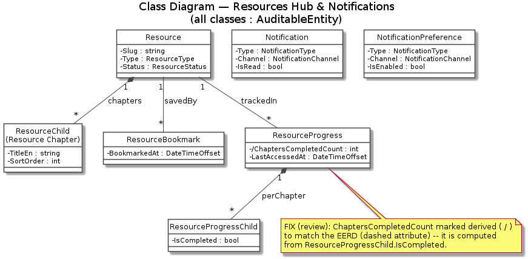

### Figure 138 — AI, Knowledge & Platform
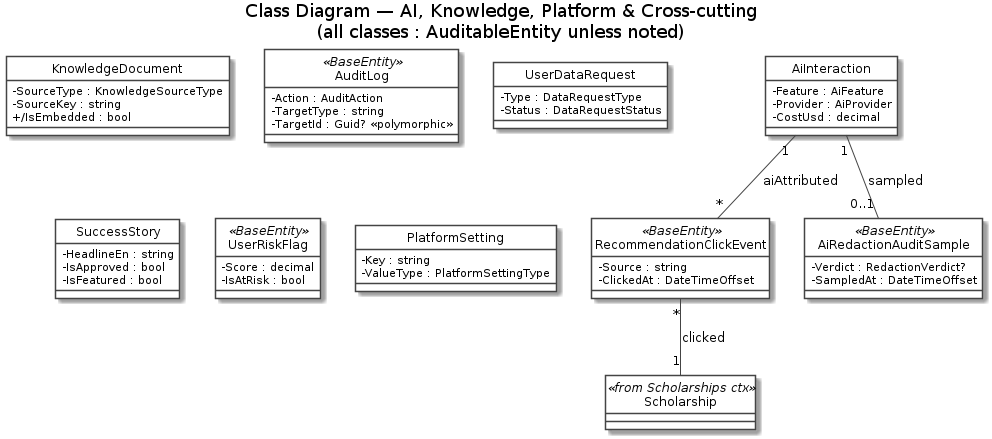

---

## EERD (Chen notation)

### System / Subject-Area Context
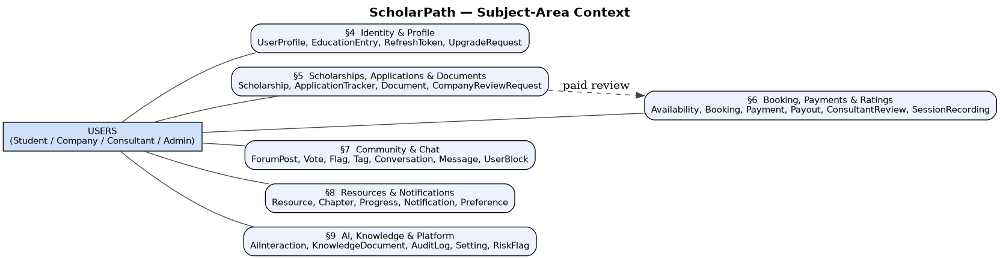

### EER Specialization — User Hierarchy
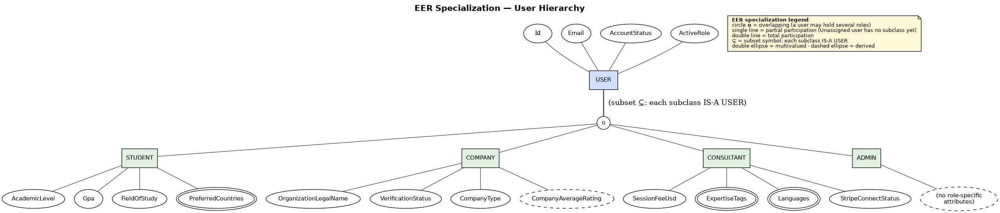

### Identity & Profile
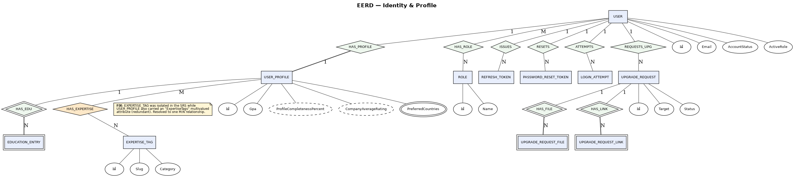

### Scholarships & Applications
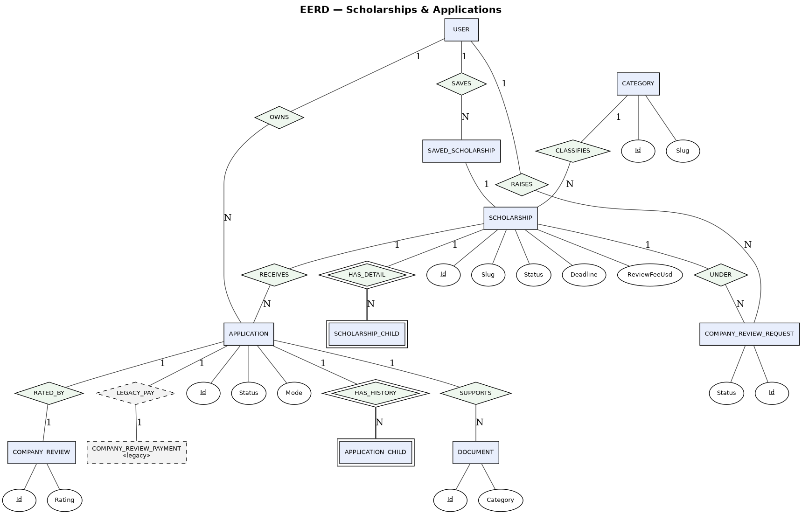

### Booking, Payments & Ratings
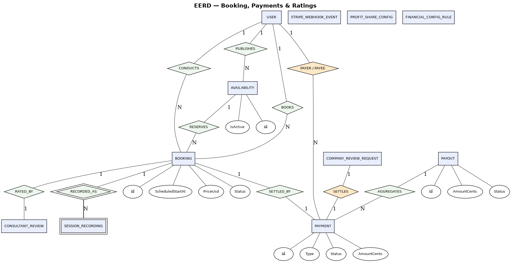

### Community & Chat
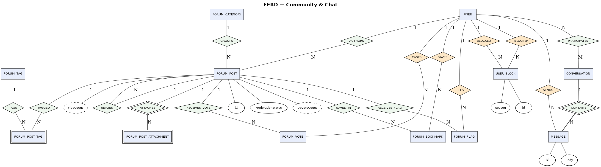

### Resources & Notifications
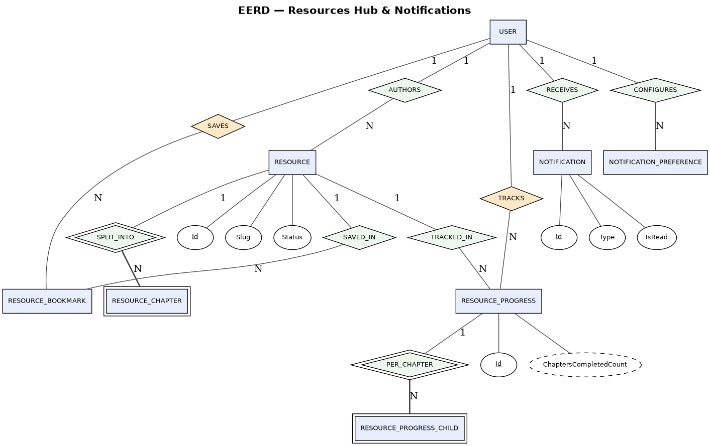

### AI, Knowledge & Platform
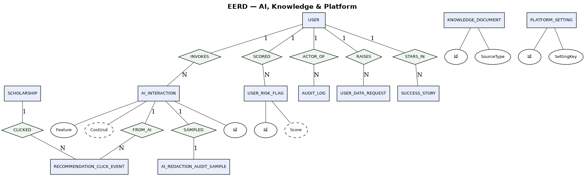

---

## Relational Mapping

### Identity & Profile
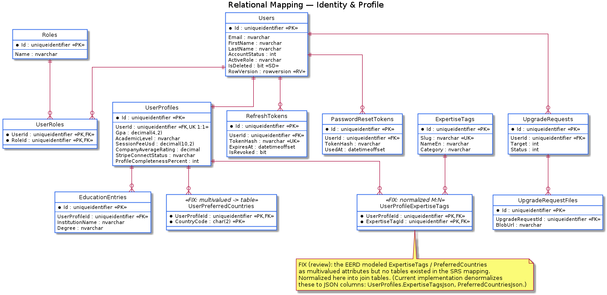

### Scholarships & Applications
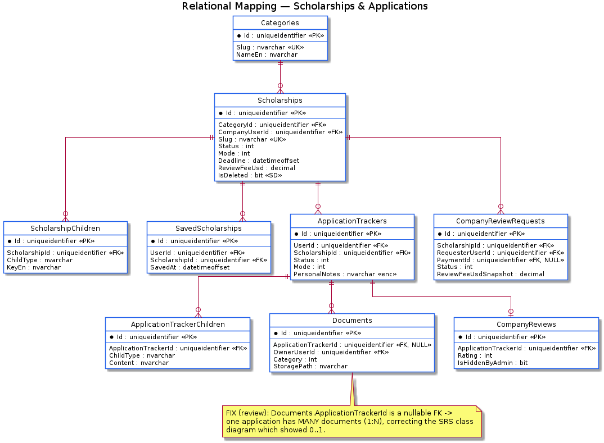

### Booking, Payments & Ratings
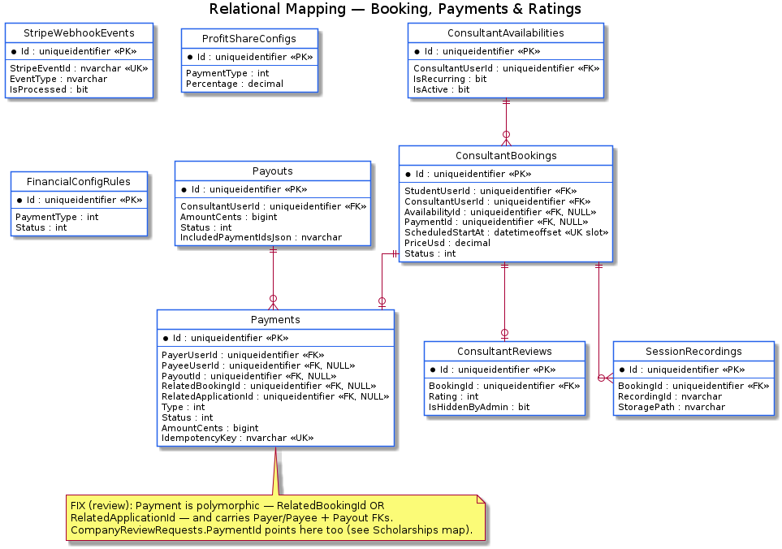

### Community & Chat
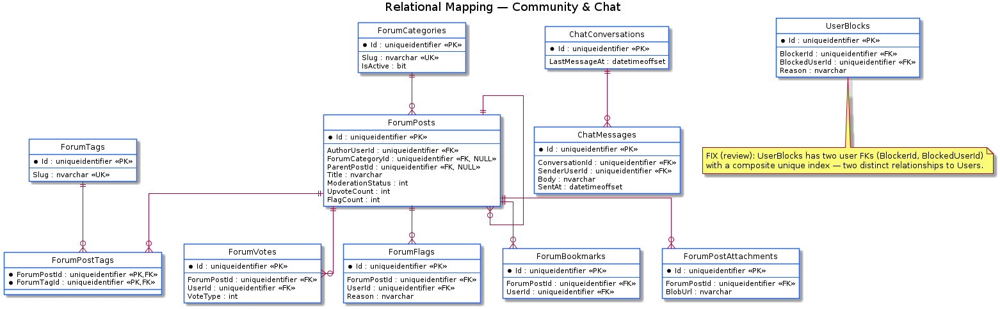

### Resources & Notifications
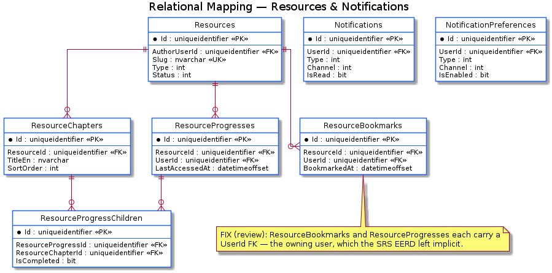

### AI, Knowledge & Platform
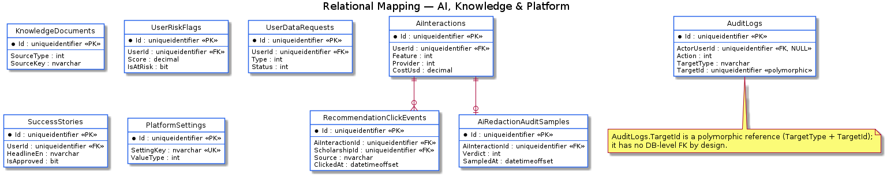
