# ScholarPath Entity Relationship Diagram

## Overview

This document describes the complete data model for ScholarPath. Most entities inherit from `BaseEntity` (providing `Id`, `CreatedAt`, `UpdatedAt`), while some inherit from `AuditableEntity` (adding `CreatedBy`, `UpdatedBy`). `ApplicationUser` is the exception — it inherits from `IdentityUser<Guid>` and defines its own `CreatedAt`. Several entities implement soft-delete behavior via `ISoftDeletable`.

---

## Full ERD

```mermaid
erDiagram
    ApplicationUser {
        guid Id PK "from IdentityUser~Guid~"
        string FirstName
        string LastName
        string ProfileImageUrl "nullable"
        int Role "UserRole enum"
        int AccountStatus "AccountStatus enum"
        bool IsOnboardingComplete
        datetime CreatedAt
        datetime LastLoginAt "nullable"
        bool IsActive
        string UserName "from IdentityUser"
        string Email "from IdentityUser"
        string PasswordHash "from IdentityUser"
        string PhoneNumber "from IdentityUser"
    }

    UserProfile {
        guid Id PK
        guid UserId FK
        string FieldOfStudy "nullable"
        decimal GPA "nullable"
        string Interests "nullable, JSON array"
        string Country "nullable"
        string TargetCountry "nullable"
        string Bio "nullable"
        string PhoneNumber "nullable"
        datetime DateOfBirth "nullable"
        string CreatedBy "nullable, AuditableEntity"
        string UpdatedBy "nullable, AuditableEntity"
        datetime CreatedAt
        datetime UpdatedAt "nullable"
    }

    RefreshToken {
        guid Id PK
        string Token
        datetime ExpiresAt
        string CreatedByIp "nullable"
        datetime RevokedAt "nullable"
        string RevokedByIp "nullable"
        string ReplacedByToken "nullable"
        guid UserId FK
        datetime CreatedAt
        datetime UpdatedAt "nullable"
    }

    UpgradeRequest {
        guid Id PK
        guid UserId FK
        int RequestedRole "UserRole enum"
        int Status "UpgradeRequestStatus enum"
        string AdminNotes "nullable"
        string RejectionReason "nullable"
        string ReviewedBy "nullable"
        datetime ReviewedAt "nullable"
        string ExperienceSummary "nullable"
        string ExpertiseTags "nullable"
        string Languages "nullable"
        string LinkedInUrl "nullable"
        string PortfolioUrl "nullable"
        string CompanyName "nullable"
        string CompanyCountry "nullable"
        string CompanyWebsite "nullable"
        string ContactPersonName "nullable"
        string ContactEmail "nullable"
        string ContactPhone "nullable"
        string CompanyRegistrationNumber "nullable"
        string ProofDocumentUrl "nullable"
        string CreatedBy "nullable, AuditableEntity"
        string UpdatedBy "nullable, AuditableEntity"
        datetime CreatedAt
        datetime UpdatedAt "nullable"
    }

    Scholarship {
        guid Id PK
        string Title
        string TitleAr "nullable"
        string Description
        string DescriptionAr "nullable"
        string Country "nullable"
        string FieldOfStudy "nullable"
        int FundingType "ScholarshipFundingType enum"
        int DegreeLevel "DegreeLevel enum"
        decimal AwardAmount "nullable"
        string Currency "nullable"
        datetime Deadline "nullable"
        string EligibilityDescription "nullable"
        string RequiredDocuments "nullable"
        string OfficialLink "nullable"
        string ImageUrl "nullable"
        bool IsActive
        decimal MinGPA "nullable"
        int MaxAge "nullable"
        string EligibleCountries "nullable, JSON array"
        string EligibleMajors "nullable, JSON array"
        guid CategoryId "nullable FK"
        bool IsDeleted "ISoftDeletable"
        datetime DeletedAt "nullable, ISoftDeletable"
        string DeletedBy "nullable, ISoftDeletable"
        string CreatedBy "nullable, AuditableEntity"
        string UpdatedBy "nullable, AuditableEntity"
        datetime CreatedAt
        datetime UpdatedAt "nullable"
    }

    SavedScholarship {
        guid Id PK
        guid UserId FK
        guid ScholarshipId FK
        datetime CreatedAt
        datetime UpdatedAt "nullable"
    }

    Category {
        guid Id PK
        string Name
        string NameAr "nullable"
        string Description "nullable"
        string DescriptionAr "nullable"
        bool IsDeleted "ISoftDeletable"
        datetime DeletedAt "nullable, ISoftDeletable"
        string DeletedBy "nullable, ISoftDeletable"
        datetime CreatedAt
        datetime UpdatedAt "nullable"
    }

    Notification {
        guid Id PK
        guid UserId FK
        int Type "NotificationType enum"
        string Title
        string TitleAr "nullable"
        string Message
        string MessageAr "nullable"
        bool IsRead
        datetime ReadAt "nullable"
        guid RelatedEntityId "nullable"
        string RelatedEntityType "nullable"
        datetime CreatedAt
        datetime UpdatedAt "nullable"
    }

    Group {
        guid Id PK
        string Name
        string NameAr "nullable"
        string Description "nullable"
        string DescriptionAr "nullable"
        guid CreatorId FK
        bool IsPrivate
        int MaxMembers "default 100"
        string ImageUrl "nullable"
        bool IsDeleted "ISoftDeletable"
        datetime DeletedAt "nullable, ISoftDeletable"
        string DeletedBy "nullable, ISoftDeletable"
        string CreatedBy "nullable, AuditableEntity"
        string UpdatedBy "nullable, AuditableEntity"
        datetime CreatedAt
        datetime UpdatedAt "nullable"
    }

    GroupMember {
        guid Id PK
        guid GroupId FK
        guid UserId FK
        int Role "GroupRole enum"
        datetime JoinedAt
        datetime CreatedAt
        datetime UpdatedAt "nullable"
    }

    Post {
        guid Id PK
        guid GroupId FK
        guid AuthorId FK
        string Content
        string ImageUrl "nullable"
        bool IsDeleted "ISoftDeletable"
        datetime DeletedAt "nullable, ISoftDeletable"
        string DeletedBy "nullable, ISoftDeletable"
        string CreatedBy "nullable, AuditableEntity"
        string UpdatedBy "nullable, AuditableEntity"
        datetime CreatedAt
        datetime UpdatedAt "nullable"
    }

    Comment {
        guid Id PK
        guid PostId FK
        guid AuthorId FK
        string Content
        guid ParentCommentId "nullable FK"
        bool IsDeleted "ISoftDeletable"
        datetime DeletedAt "nullable, ISoftDeletable"
        string DeletedBy "nullable, ISoftDeletable"
        string CreatedBy "nullable, AuditableEntity"
        string UpdatedBy "nullable, AuditableEntity"
        datetime CreatedAt
        datetime UpdatedAt "nullable"
    }

    Like {
        guid Id PK
        guid UserId FK
        guid PostId "nullable FK"
        guid CommentId "nullable FK"
        datetime CreatedAt
        datetime UpdatedAt "nullable"
    }

    Message {
        guid Id PK
        guid SenderId FK
        guid ReceiverId "nullable FK"
        guid GroupId "nullable FK"
        string Content
        datetime SentAt
        bool IsRead
        datetime ReadAt "nullable"
        bool IsDeleted "ISoftDeletable"
        datetime DeletedAt "nullable, ISoftDeletable"
        string DeletedBy "nullable, ISoftDeletable"
        datetime CreatedAt
        datetime UpdatedAt "nullable"
    }

    Resource {
        guid Id PK
        string Title
        string TitleAr "nullable"
        string Description "nullable"
        string DescriptionAr "nullable"
        string Url
        string Type "nullable"
        string Category "nullable"
        bool IsDeleted "ISoftDeletable"
        datetime DeletedAt "nullable, ISoftDeletable"
        string DeletedBy "nullable, ISoftDeletable"
        string CreatedBy "nullable, AuditableEntity"
        string UpdatedBy "nullable, AuditableEntity"
        datetime CreatedAt
        datetime UpdatedAt "nullable"
    }

    SuccessStory {
        guid Id PK
        guid UserId FK
        string Title
        string TitleAr "nullable"
        string Content
        string ContentAr "nullable"
        string ImageUrl "nullable"
        bool IsApproved
        datetime ApprovedAt "nullable"
        string ApprovedBy "nullable"
        bool IsDeleted "ISoftDeletable"
        datetime DeletedAt "nullable, ISoftDeletable"
        string DeletedBy "nullable, ISoftDeletable"
        string CreatedBy "nullable, AuditableEntity"
        string UpdatedBy "nullable, AuditableEntity"
        datetime CreatedAt
        datetime UpdatedAt "nullable"
    }

    %% === Relationships ===

    ApplicationUser ||--o| UserProfile : "has one"
    ApplicationUser ||--o{ RefreshToken : "has many"
    ApplicationUser ||--o{ UpgradeRequest : "submits"
    ApplicationUser ||--o{ SavedScholarship : "saves"
    ApplicationUser ||--o{ Notification : "receives"
    ApplicationUser ||--o{ Group : "creates"
    ApplicationUser ||--o{ GroupMember : "joins as"
    ApplicationUser ||--o{ Like : "gives"
    ApplicationUser ||--o{ Message : "sends"

    ApplicationUser ||--o{ Message : "receives"

    Category ||--o{ Scholarship : "contains"
    Scholarship ||--o{ SavedScholarship : "saved by users"

    Group ||--o{ GroupMember : "has members"
    Group ||--o{ Post : "contains"

    Post ||--o{ Comment : "has comments"
    Post ||--o{ Like : "receives likes"

    Comment ||--o{ Comment : "has replies"
    Comment ||--o{ Like : "receives likes"

    ApplicationUser ||--o{ Post : "authors"
    ApplicationUser ||--o{ Comment : "writes"
    ApplicationUser ||--o{ SuccessStory : "shares"
```

---

## Relationship Summary

| Relationship | Type | Description |
|---|---|---|
| ApplicationUser - UserProfile | One-to-One | Each user has at most one profile |
| ApplicationUser - RefreshToken | One-to-Many | A user can have multiple refresh tokens |
| ApplicationUser - UpgradeRequest | One-to-Many | A user can submit multiple upgrade requests over time |
| ApplicationUser - SavedScholarship | One-to-Many | A user saves multiple scholarships |
| Scholarship - SavedScholarship | One-to-Many | A scholarship can be saved by many users |
| Category - Scholarship | One-to-Many | Each scholarship optionally belongs to one category (nullable FK) |
| ApplicationUser - Notification | One-to-Many | A user receives many notifications |
| ApplicationUser - Group (Creator) | One-to-Many | A user can create multiple groups |
| Group - GroupMember | One-to-Many | A group has many members |
| ApplicationUser - GroupMember | One-to-Many | A user can be a member of many groups |
| Group - Post | One-to-Many | A group contains many posts |
| ApplicationUser - Post (Author) | One-to-Many | A user authors many posts |
| Post - Comment | One-to-Many | A post has many comments |
| Comment - Comment (Self-ref) | One-to-Many | A comment can have nested replies via ParentCommentId |
| ApplicationUser - Comment (Author) | One-to-Many | A user writes many comments |
| Post - Like | One-to-Many | A post can have many likes |
| Comment - Like | One-to-Many | A comment can have many likes |
| ApplicationUser - Like | One-to-Many | A user can give many likes |
| ApplicationUser - Message (Sender) | One-to-Many | A user sends many messages |
| ApplicationUser - Message (Receiver) | One-to-Many | A user receives many direct messages |
| Group - Message | — | Messages can reference a group, but Group has no Messages nav property |
| ApplicationUser - SuccessStory | One-to-Many | A user can share many success stories |

---

## Notes

- **ApplicationUser** inherits from `IdentityUser<Guid>` (not `BaseEntity`). It defines its own `CreatedAt` and includes Identity fields like `UserName`, `Email`, `PasswordHash`, etc.
- **SavedScholarship** serves as a join table implementing a many-to-many relationship between `ApplicationUser` and `Scholarship`.
- **GroupMember** serves as a join table implementing a many-to-many relationship between `ApplicationUser` and `Group`, with an additional `Role` field.
- **Like** is polymorphic: it references either a `Post` or a `Comment` (one of the two foreign keys is always null).
- **Message** is polymorphic: it targets either a specific `ReceiverId` (direct message) or a `GroupId` (group message). It also implements `ISoftDeletable` and has `SentAt`/`ReadAt` timestamps.
- **Comment** supports threading via the self-referencing `ParentCommentId` foreign key.
- **Scholarship.CategoryId** is nullable — a scholarship may exist without a category.
- **Resource** has no navigation properties to other entities (no `UploadedById` FK) and no foreign key relationships in the current model.
- Several entities use Arabic-language fields (`TitleAr`, `DescriptionAr`, `NameAr`, `ContentAr`, `MessageAr`) for bilingual support.
- **UpgradeRequest** contains role-specific fields: consultant fields (`ExperienceSummary`, `LinkedInUrl`, etc.) and company fields (`CompanyName`, `CompanyWebsite`, etc.).
